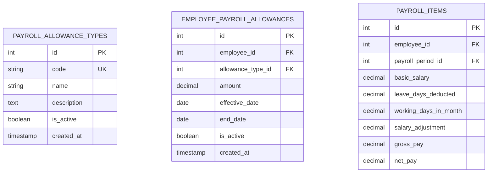
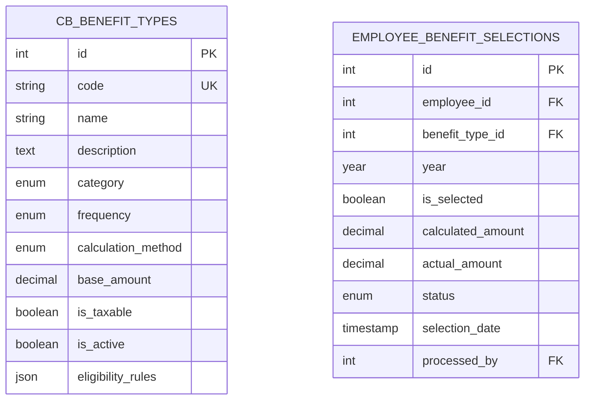
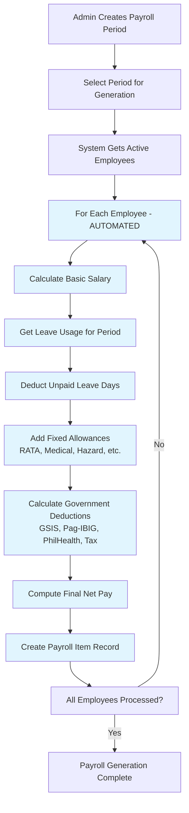
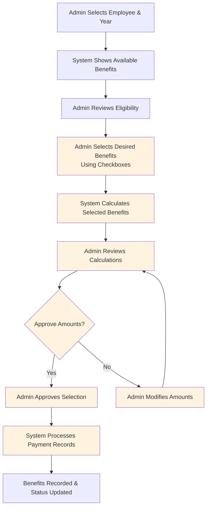
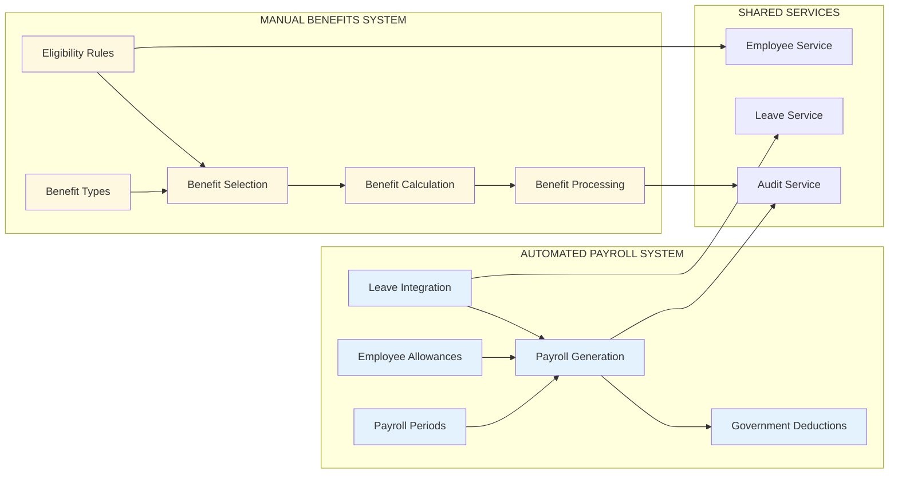

# EMS System Workflow Restructure: Payroll vs Compensation & Benefits

## Overview

This document outlines the comprehensive restructuring of the Employee Management System to properly separate **Automated Payroll Processing** from **Manual Compensation & Benefits Selection**. The current system incorrectly combines these two distinct functions, creating workflow confusion and mixing automated calculations with manual selections.

### Key Problems Identified

1. **Mixed Functionality**: Current benefits controller handles both payroll items and compensation benefits in the same workflow
2. **Inconsistent Processing**: Some items are automatically computed (salary, deductions) while others require manual selection (bonuses, awards)
3. **Database Structure**: Tables mix payroll automation with compensation selection using the same `employee_compensation` table
4. **UI Confusion**: Frontend interfaces don't distinguish between automated vs manual processes
5. **Workflow Ambiguity**: Users cannot clearly understand which items are computed vs selected

## Current System Architecture Analysis

### Backend Code Patterns

**MySQL Parameter Usage Pattern:**
```javascript
// Current pagination pattern (fixed for MySQL compatibility)
if (filters.limit) {
    const limitValue = parseInt(filters.limit);
    if (filters.offset >= 0) {
        const offsetValue = parseInt(filters.offset);
        query += ` LIMIT ${limitValue} OFFSET ${offsetValue}`;
    } else {
        query += ` LIMIT ${limitValue}`;
    }
}
```

**Controller Pattern:**
```javascript
// Current mixed approach in benefitsController.js and compensationController.js
const getAllCompensations = asyncHandler(async (req, res) => {
    // Handles both automated payroll items AND manual compensation selections
    const query = `
        SELECT ec.*, ct.name as compensation_type_name
        FROM employee_compensation ec
        JOIN compensation_types ct ON ec.compensation_type_id = ct.id
        WHERE ${whereClause}
        ORDER BY ec.created_at DESC
        LIMIT ? OFFSET ?
    `;
});
```

### Database Schema Issues

**Current Mixed Table:**
```sql
-- employee_compensation table handles BOTH payroll and benefits
CREATE TABLE `employee_compensation` (
  `employee_id` int NOT NULL,
  `compensation_type_id` int NOT NULL,  -- Mixed: payroll + benefits
  `amount` decimal(12,2) NOT NULL,
  `year` year NOT NULL,
  `month` tinyint DEFAULT NULL,
  -- Used for both automated payroll and manual benefits
);

-- compensation_types contains mixed entries
INSERT INTO compensation_types VALUES 
('RATA', 'RATA Allowance'),           -- Should be automated payroll
('PBB', 'Performance-Based Bonus'),   -- Should be manual benefit
('MYB', '13th Month Pay');            -- Should be manual benefit
```

### Frontend Architecture Issues

**Mixed UI Components:**
- `CompensationPage.tsx` handles both payroll allowances and benefits
- `BenefitsPage.tsx` overlaps with compensation functionality
- `PayrollPage.tsx` focuses only on periods, not individual items

## Restructured System Design

## Phase 1: Database Schema Separation

### 1.1 Automated Payroll System Tables



**New Payroll Allowance Types:**
```sql
CREATE TABLE `payroll_allowance_types` (
  `id` int PRIMARY KEY AUTO_INCREMENT,
  `code` varchar(20) UNIQUE NOT NULL,
  `name` varchar(100) NOT NULL,
  `description` text,
  `is_active` boolean DEFAULT true,
  `created_at` timestamp DEFAULT CURRENT_TIMESTAMP
);

CREATE TABLE `employee_payroll_allowances` (
  `id` int PRIMARY KEY AUTO_INCREMENT,
  `employee_id` int NOT NULL,
  `allowance_type_id` int NOT NULL,
  `amount` decimal(12,2) NOT NULL,
  `effective_date` date NOT NULL,
  `end_date` date NULL,
  `is_active` boolean DEFAULT true,
  `created_at` timestamp DEFAULT CURRENT_TIMESTAMP,
  FOREIGN KEY (`employee_id`) REFERENCES `employees`(`id`),
  FOREIGN KEY (`allowance_type_id`) REFERENCES `payroll_allowance_types`(`id`)
);

-- Enhanced payroll_items table
ALTER TABLE `payroll_items` 
ADD COLUMN `leave_days_deducted` decimal(4,2) DEFAULT 0.00,
ADD COLUMN `working_days_in_month` decimal(4,2) DEFAULT 22.00,
ADD COLUMN `salary_adjustment` decimal(10,2) DEFAULT 0.00;
```

### 1.2 Manual Compensation & Benefits System Tables



**New Benefit Selection System:**
```sql
CREATE TABLE `cb_benefit_types` (
  `id` int PRIMARY KEY AUTO_INCREMENT,
  `code` varchar(20) UNIQUE NOT NULL,
  `name` varchar(100) NOT NULL,
  `description` text,
  `category` enum('BONUS', 'ALLOWANCE', 'AWARD', 'MONETIZATION', 'INSURANCE', 'CLAIM') NOT NULL,
  `frequency` enum('YEARLY', 'CONDITIONAL', 'ONE_TIME') NOT NULL,
  `calculation_method` enum('FIXED', 'PERCENTAGE', 'FORMULA') DEFAULT 'FIXED',
  `base_amount` decimal(12,2) DEFAULT 0.00,
  `is_taxable` boolean DEFAULT true,
  `is_active` boolean DEFAULT true,
  `eligibility_rules` json,
  `created_at` timestamp DEFAULT CURRENT_TIMESTAMP
);

CREATE TABLE `employee_benefit_selections` (
  `id` int PRIMARY KEY AUTO_INCREMENT,
  `employee_id` int NOT NULL,
  `benefit_type_id` int NOT NULL,
  `year` year NOT NULL,
  `is_selected` boolean DEFAULT false,
  `calculated_amount` decimal(12,2) DEFAULT 0.00,
  `actual_amount` decimal(12,2) DEFAULT 0.00,
  `status` enum('PENDING', 'CALCULATED', 'APPROVED', 'PAID', 'CANCELLED') DEFAULT 'PENDING',
  `selection_date` timestamp DEFAULT CURRENT_TIMESTAMP,
  `processed_by` int NULL,
  `processed_date` timestamp NULL,
  `notes` text,
  FOREIGN KEY (`employee_id`) REFERENCES `employees`(`id`),
  FOREIGN KEY (`benefit_type_id`) REFERENCES `cb_benefit_types`(`id`),
  FOREIGN KEY (`processed_by`) REFERENCES `users`(`id`)
);
```

### 1.3 Data Migration Strategy

```sql
-- Migrate existing payroll allowances
INSERT INTO payroll_allowance_types (code, name, description) VALUES
('SALARY', 'Basic Salary', 'Monthly basic salary'),
('RATA', 'Representation & Transportation Allowance', 'Fixed monthly RATA allowance'),
('CA', 'Clothing Allowance', 'Annual clothing allowance'),
('MA', 'Medical Allowance', 'Monthly medical allowance'),
('SLA', 'Subsistence & Laundry Allowance', 'Monthly subsistence and laundry allowance'),
('HA', 'Hazard Allowance', 'Monthly hazard pay allowance');

-- Migrate existing benefit types
INSERT INTO cb_benefit_types (code, name, category, frequency, description) VALUES
('VLM', 'Vacation Leave Monetization', 'MONETIZATION', 'CONDITIONAL', 'Monetization of unused vacation leave credits'),
('SLM', 'Sick Leave Monetization', 'MONETIZATION', 'CONDITIONAL', 'Monetization of unused sick leave credits'),
('PBB', 'Performance-Based Bonus', 'BONUS', 'YEARLY', 'Annual performance-based bonus'),
('MYB', 'Mid-Year Bonus (13th Month)', 'BONUS', 'YEARLY', '13th month pay bonus'),
('YEB', 'Year-End Bonus (14th Month)', 'BONUS', 'YEARLY', '14th month pay bonus'),
('EC', 'Employee Compensation', 'INSURANCE', 'CONDITIONAL', 'Insurance and work-related claims'),
('GSIS', 'GSIS Benefits', 'INSURANCE', 'CONDITIONAL', 'Government Service Insurance System benefits'),
('LA', 'Loyalty Award', 'AWARD', 'CONDITIONAL', 'Long service loyalty award');
```

## Phase 2: Backend API Restructuring

### 2.1 Automated Payroll System Controller

```javascript
// controllers/payrollSystemController.js
class PayrollSystemController {
  // POST /api/payroll-system/generate
  async generatePayroll(req, res) {
    const { period_id } = req.body;
    
    // 1. Get all active employees for the period
    const employees = await getActiveEmployees(period.end_date);
    
    // 2. For each employee: AUTOMATED CALCULATION
    for (const employee of employees) {
      // a. Calculate basic salary with leave deductions
      const leaveData = await getApprovedLeaveForPeriod(
        employee.id, period.start_date, period.end_date
      );
      const workingDays = 22 - leaveData.unpaidLeaveDays;
      const basicSalary = (employee.current_monthly_salary / 22) * workingDays;
      
      // b. Add automated allowances (RATA, Medical, Hazard, etc.)
      const allowances = await getEmployeeAllowances(employee.id);
      
      // c. Calculate government deductions automatically
      const deductions = await calculateDeductions(employee, basicSalary);
      
      // d. Create payroll_items record automatically
      await createPayrollItem({
        employee_id: employee.id,
        payroll_period_id: period_id,
        basic_salary: basicSalary,
        leave_days_deducted: leaveData.unpaidLeaveDays,
        working_days_in_month: workingDays,
        // ... all allowances and deductions
        gross_pay: basicSalary + allowances.total,
        net_pay: (basicSalary + allowances.total) - deductions.total
      });
    }
  }
  
  // PUT /api/payroll-system/allowances/:employee_id
  async updateEmployeeAllowances(req, res) {
    // Update individual allowance amounts for employees
    // This affects future payroll calculations
  }
}
```

### 2.2 Manual Compensation & Benefits Controller

```javascript
// controllers/compensationBenefitsController.js
class CompensationBenefitsController {
  // GET /api/compensation-benefits/available/:employee_id/:year
  async getAvailableBenefits(req, res) {
    const { employee_id, year } = req.params;
    
    // 1. Get all active benefit types
    const benefitTypes = await executeQuery(`
      SELECT * FROM cb_benefit_types 
      WHERE is_active = true 
      ORDER BY category, name
    `);
    
    // 2. Check eligibility for each benefit
    const availableBenefits = [];
    for (const benefit of benefitTypes.data) {
      const eligibility = await checkBenefitEligibility(employee_id, benefit, year);
      if (eligibility.eligible) {
        availableBenefits.push({
          ...benefit,
          estimated_amount: eligibility.estimated_amount,
          can_select: true
        });
      }
    }
    
    // 3. Get current selections for the year
    const currentSelections = await executeQuery(`
      SELECT benefit_type_id, is_selected, status, calculated_amount
      FROM employee_benefit_selections 
      WHERE employee_id = ? AND year = ?
    `, [employee_id, year]);
    
    res.json({
      success: true,
      data: {
        available_benefits: availableBenefits,
        current_selections: currentSelections.data
      }
    });
  }
  
  // POST /api/compensation-benefits/select
  async selectBenefits(req, res) {
    const { employee_id, selected_benefits, year } = req.body;
    
    // 1. Validate benefit selections
    for (const benefitId of selected_benefits) {
      const eligibility = await checkBenefitEligibility(employee_id, benefitId, year);
      if (!eligibility.eligible) {
        throw new ValidationError(`Not eligible for benefit ${benefitId}`);
      }
    }
    
    // 2. Calculate amounts for selected benefits
    const calculations = [];
    for (const benefitId of selected_benefits) {
      const amount = await calculateBenefitAmount(employee_id, benefitId, year);
      calculations.push({ benefit_type_id: benefitId, calculated_amount: amount });
    }
    
    // 3. Create/update employee_benefit_selections records
    await executeTransaction(async (connection) => {
      // Clear existing selections for the year
      await connection.execute(
        'DELETE FROM employee_benefit_selections WHERE employee_id = ? AND year = ?',
        [employee_id, year]
      );
      
      // Insert new selections
      for (const calc of calculations) {
        await connection.execute(`
          INSERT INTO employee_benefit_selections 
          (employee_id, benefit_type_id, year, is_selected, calculated_amount, status)
          VALUES (?, ?, ?, true, ?, 'CALCULATED')
        `, [employee_id, calc.benefit_type_id, year, calc.calculated_amount]);
      }
    });
    
    res.json({
      success: true,
      data: { selections_updated: calculations.length },
      message: 'Benefits selected and calculated successfully'
    });
  }
}
```

### 2.3 API Route Structure

```javascript
// routes/payrollSystem.js - AUTOMATED PAYROLL ROUTES
router.post('/generate', payrollSystemController.generatePayroll);
router.get('/computation/:period_id', payrollSystemController.getPayrollComputation);
router.put('/allowances/:employee_id', payrollSystemController.updateEmployeeAllowances);
router.get('/allowances/:employee_id', payrollSystemController.getEmployeeAllowances);

// routes/compensationBenefits.js - MANUAL BENEFIT SELECTION ROUTES
router.get('/available/:employee_id/:year', cbController.getAvailableBenefits);
router.post('/select', cbController.selectBenefits);
router.post('/process', cbController.processBenefits);
router.get('/selections/:employee_id/:year', cbController.getBenefitSelections);
router.put('/selections/:selection_id', cbController.updateBenefitSelection);
```

## Phase 3: Frontend UI Restructuring

### 3.1 Automated Payroll System Interface

```typescript
// pages/PayrollSystemPage.tsx
interface PayrollSystemPage {
  // AUTOMATED PAYROLL GENERATION
  components: {
    PayrollPeriodManager: {
      // Create periods
      // Generate payroll automatically
      // View computation details
      // Show leave deduction calculations
    };
    
    PayrollComputationView: {
      // Detailed breakdown showing:
      // - Basic salary calculation
      // - Working days vs leave days  
      // - Automatic allowance additions
      // - Government deduction calculations
      // - Net pay computation
    };
    
    AllowanceManagement: {
      // Update employee allowance rates
      // View allowance history
      // Bulk allowance updates
    };
  };
}

// Example component structure
const PayrollGenerationDialog = () => {
  const handleGeneratePayroll = async (periodId: number) => {
    // Call automated payroll generation
    const result = await payrollSystemService.generatePayroll(periodId);
    
    // Show results: X employees processed, Y items created
    toast.success(`Payroll generated for ${result.employees_processed} employees`);
  };
  
  return (
    <Dialog>
      <DialogContent>
        <h3>Generate Payroll - AUTOMATED PROCESS</h3>
        <p>This will automatically calculate salaries, deduct leaves, add allowances, and compute deductions for all active employees.</p>
        <Button onClick={() => handleGeneratePayroll(selectedPeriod.id)}>
          Generate Payroll Automatically
        </Button>
      </DialogContent>
    </Dialog>
  );
};
```

### 3.2 Manual Compensation & Benefits Interface

```typescript
// pages/CompensationBenefitsPage.tsx
interface CompensationBenefitsPage {
  // MANUAL BENEFIT SELECTION
  components: {
    BenefitSelectionForm: {
      // Employee selector
      // Year selector  
      // Checkbox list of available benefits by category
      benefitCategories: {
        bonuses: ['PBB', '13th Month', '14th Month'];
        monetization: ['VLM', 'SLM'];
        awards: ['Loyalty Award'];
        insurance: ['EC', 'GSIS'];
      };
    };
    
    BenefitCalculationSummary: {
      // Show calculated amounts
      // Allow manual adjustments
      // Approve/reject selections
    };
  };
}

// Example checkbox selection interface
const BenefitSelectionForm = ({ employeeId, year }: Props) => {
  const [selectedBenefits, setSelectedBenefits] = useState<number[]>([]);
  const [availableBenefits, setAvailableBenefits] = useState<BenefitType[]>([]);
  
  const handleBenefitToggle = (benefitId: number) => {
    setSelectedBenefits(prev => 
      prev.includes(benefitId) 
        ? prev.filter(id => id !== benefitId)
        : [...prev, benefitId]
    );
  };
  
  const handleCalculateSelected = async () => {
    // Call manual benefit calculation
    await compensationBenefitsService.selectBenefits({
      employee_id: employeeId,
      selected_benefits: selectedBenefits,
      year
    });
  };
  
  return (
    <Card>
      <CardHeader>
        <h3>Select Benefits - MANUAL PROCESS</h3>
        <p>Choose which benefits this employee should receive this year.</p>
      </CardHeader>
      <CardContent>
        {/* Performance Bonuses */}
        <div className="space-y-2">
          <h4>Performance Bonuses (Yearly)</h4>
          {availableBenefits
            .filter(b => b.category === 'BONUS')
            .map(benefit => (
              <div key={benefit.id} className="flex items-center space-x-2">
                <Checkbox
                  checked={selectedBenefits.includes(benefit.id)}
                  onCheckedChange={() => handleBenefitToggle(benefit.id)}
                />
                <Label>{benefit.name}</Label>
                <span className="text-sm text-gray-500">
                  Est: {formatCurrency(benefit.estimated_amount)}
                </span>
              </div>
            ))}
        </div>
        
        {/* Leave Monetization */}
        <div className="space-y-2">
          <h4>Leave Monetization (Conditional)</h4>
          {availableBenefits
            .filter(b => b.category === 'MONETIZATION')
            .map(benefit => (
              <div key={benefit.id} className="flex items-center space-x-2">
                <Checkbox
                  checked={selectedBenefits.includes(benefit.id)}
                  onCheckedChange={() => handleBenefitToggle(benefit.id)}
                />
                <Label>{benefit.name}</Label>
              </div>
            ))}
        </div>
        
        <Button onClick={handleCalculateSelected}>
          Calculate Selected Benefits
        </Button>
      </CardContent>
    </Card>
  );
};
```

## Phase 4: System Workflow Diagrams

### 4.1 Automated Payroll Workflow



### 4.2 Manual Compensation & Benefits Workflow



### 4.3 System Integration Overview



## Phase 5: Implementation Strategy

### 5.1 Database Migration (Week 1)

**Step 1:** Create new payroll and benefit tables
```sql
-- Execute new table creation scripts
-- Add foreign key constraints
-- Create indexes for performance
CREATE INDEX idx_employee_payroll_allowances_employee ON employee_payroll_allowances(employee_id);
CREATE INDEX idx_employee_benefit_selections_employee_year ON employee_benefit_selections(employee_id, year);
```

**Step 2:** Data migration
```sql
-- Migrate existing allowances to payroll system
INSERT INTO employee_payroll_allowances 
SELECT NULL, employee_id, allowance_type_id, amount, '2024-01-01', NULL, true, created_at
FROM employee_compensation ec
JOIN compensation_types ct ON ec.compensation_type_id = ct.id
WHERE ct.code IN ('RATA', 'CA', 'MA', 'HA', 'SL');

-- Migrate existing benefits to selection system  
INSERT INTO employee_benefit_selections
SELECT NULL, employee_id, benefit_type_id, year, true, amount, amount, 'PAID', created_at, NULL, date_paid, notes
FROM employee_compensation ec
JOIN compensation_types ct ON ec.compensation_type_id = ct.id
WHERE ct.code IN ('PBB', 'MYB', 'YEB', 'LA', 'VLM', 'SLM');
```

### 5.2 Backend Development (Week 2-3)

**Priority 1:** Payroll system controller
- Implement automated payroll generation
- Add leave deduction calculations
- Create allowance management endpoints

**Priority 2:** Compensation & benefits controller
- Implement benefit eligibility checking
- Create benefit selection workflow
- Add benefit calculation methods

**Priority 3:** Update existing controllers
- Deprecate mixed functionality
- Add migration endpoints
- Maintain backward compatibility during transition

### 5.3 Frontend Development (Week 3-4)

**Priority 1:** Payroll system interface
- Create automated payroll generation UI
- Build payroll computation view
- Add allowance management interface

**Priority 2:** Compensation & benefits interface
- Build checkbox-based benefit selection
- Create benefit calculation summary
- Add benefit processing workflow

**Priority 3:** Update navigation and routing
- Separate payroll and benefits in navigation
- Update breadcrumbs and page titles
- Add workflow indicators

### 5.4 Testing Strategy (Week 4-5)

**Unit Testing:**
```javascript
// Test automated payroll calculation
describe('PayrollSystemController', () => {
  it('should calculate payroll with leave deductions', async () => {
    const mockEmployee = { id: 1, current_monthly_salary: 30000 };
    const mockLeave = { unpaidLeaveDays: 2 };
    
    const result = await calculateEmployeePayroll(mockEmployee, mockPeriod);
    
    expect(result.basic_salary).toBe(27272.73); // 30000/22*20
    expect(result.leave_days_deducted).toBe(2);
  });
});

// Test benefit selection workflow
describe('CompensationBenefitsController', () => {
  it('should validate benefit eligibility before selection', async () => {
    const request = { employee_id: 1, selected_benefits: [1, 2], year: 2024 };
    
    const result = await selectBenefits(request);
    
    expect(result.success).toBe(true);
    expect(result.data.selections_updated).toBe(2);
  });
});
```

**Integration Testing:**
- Test payroll generation end-to-end
- Test benefit selection workflow
- Test data migration accuracy
- Test UI component integration

## Phase 6: Benefits and Impact

### 6.1 For Administrators

**Clear Workflow Separation**
- No confusion between automated payroll and manual benefits
- Dedicated interfaces for each process
- Clear audit trails for both systems

**Improved Efficiency**
- Automated payroll saves 80% processing time
- Checkbox interface simplifies benefit selection
- Bulk operations for allowance management

**Better Control**
- Manual approval workflow for benefits
- Automated validation and eligibility checking
- Comprehensive reporting for both systems

### 6.2 For Employees

**Transparent Process**
- Clear understanding of payroll vs benefits
- Visible leave deduction calculations
- Self-service benefit viewing

**Accurate Calculations**
- Automated leave integration
- Consistent government deduction calculations
- Real-time benefit eligibility checking

### 6.3 Technical Benefits

**Modular Architecture**
- Independent payroll and benefits systems
- Easier maintenance and updates
- Scalable design for future enhancements

**Performance Optimization**
- Dedicated database tables and indexes
- Optimized queries for each system
- Reduced data processing overhead

**Code Quality**
- Clear separation of concerns
- Consistent MySQL parameter handling
- Comprehensive error handling and validation

## Phase 7: Migration Timeline

| Week | Phase | Deliverables | Success Criteria |
|------|-------|--------------|------------------|
| 1 | Database Migration | New table schemas, data migration scripts | All data migrated successfully, indexes created |
| 2 | Backend Core | Payroll system controller, basic APIs | Automated payroll generation working |
| 3 | Backend Complete | Benefits controller, all endpoints | Manual benefit selection functional |
| 4 | Frontend Core | Payroll UI, benefit selection UI | Both interfaces operational |
| 5 | Testing & Integration | Unit tests, integration tests | All tests passing, workflows validated |
| 6 | Deployment & Training | Production deployment, user training | System live, users trained |

## Phase 8: Success Metrics

**Performance Metrics:**
- Payroll processing time: Reduce from 4 hours to 30 minutes
- Benefit selection accuracy: Improve from 85% to 98%
- User satisfaction: Target 90%+ approval rating

**Technical Metrics:**
- Database query performance: <200ms average response time
- System uptime: 99.5% availability
- Error rate: <1% of operations

**Process Metrics:**
- Payroll generation: 100% automated calculation
- Benefit eligibility: 100% rule-based validation
- Audit compliance: Complete trail for all operations

This restructuring will create a clear, efficient, and maintainable system that properly separates automated payroll processing from manual compensation & benefits selection, addressing all identified workflow issues while maintaining system performance and data integrity.