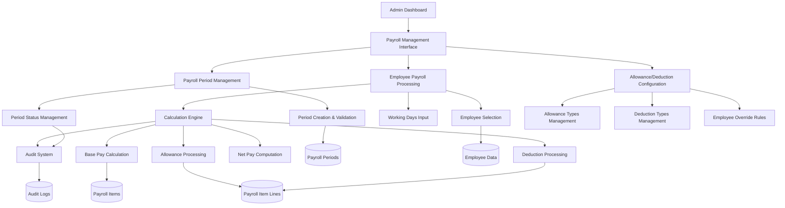
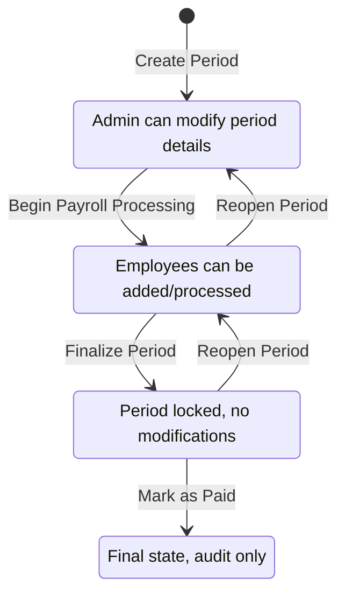
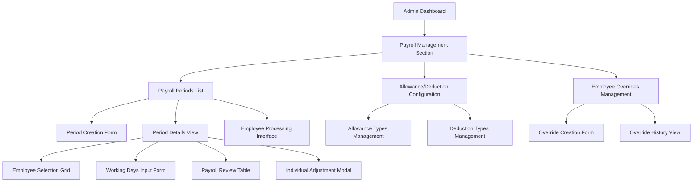

# Payroll Module Workflow Analysis & Implementation Design

## Overview

This design document outlines the implementation of a comprehensive payroll management system within the existing Employee Management System (EMS). The payroll module introduces structured workflows for managing payroll periods, allowances, deductions, and payment processing while maintaining audit trails and compliance with organizational requirements.

The payroll system integrates seamlessly with existing employee data, leveraging current salary information and employment status to automate payroll calculations while providing flexibility for manual adjustments and administrative oversight.

## Architecture

### System Integration Approach

The payroll module extends the existing EMS architecture by introducing new data models, controllers, and services that interact with current employee and user management systems. The design maintains architectural consistency with the existing Express.js backend and React frontend structure.



### Core Components Architecture

| Component | Purpose | Dependencies |
|-----------|---------|--------------|
| Payroll Period Manager | Manages payroll period lifecycle and validation | Employee Model, System Settings |
| Calculation Engine | Performs payroll computations with configurable rules | Employee Data, Allowance/Deduction Rules |
| Allowance/Deduction Service | Handles allowance and deduction type management | System Configuration, Employee Overrides |
| Payment Processor | Manages payment status and payslip generation | Payroll Items, Audit Logger |
| Audit Integration | Tracks all payroll-related activities | Existing Audit System |

## Data Models & Schema Design

### Payroll Periods

Manages distinct payroll processing periods with comprehensive status tracking and validation.

| Field | Type | Purpose | Constraints |
|-------|------|---------|-------------|
| id | INT AUTO_INCREMENT | Primary identifier | PRIMARY KEY |
| year | YEAR | Payroll year | NOT NULL |
| month | TINYINT | Payroll month (1-12) | NOT NULL, RANGE 1-12 |
| period_number | TINYINT | Period within month (1 or 2) | NOT NULL, RANGE 1-2 |
| start_date | DATE | Period start date | NOT NULL |
| end_date | DATE | Period end date | NOT NULL |
| pay_date | DATE | Scheduled payment date | NOT NULL |
| status | ENUM | Processing status | 'Draft', 'Processing', 'Completed', 'Paid' |
| created_by | INT | Admin who created period | FOREIGN KEY users(id) |
| finalized_by | INT | Admin who finalized period | FOREIGN KEY users(id) |
| finalized_at | TIMESTAMP | Finalization timestamp | NULL |
| created_at | TIMESTAMP | Creation timestamp | DEFAULT CURRENT_TIMESTAMP |

**Unique Constraints**: (year, month, period_number)

### Allowance Types

Defines configurable allowance categories with flexible application rules.

| Field | Type | Purpose | Constraints |
|-------|------|---------|-------------|
| id | INT AUTO_INCREMENT | Primary identifier | PRIMARY KEY |
| name | VARCHAR(100) | Allowance name | NOT NULL, UNIQUE |
| code | VARCHAR(20) | Short code identifier | NOT NULL, UNIQUE |
| description | TEXT | Detailed description | NULL |
| default_amount | DECIMAL(12,2) | Default allowance amount | NULL |
| calculation_type | ENUM | How amount is determined | 'Fixed', 'Percentage', 'Formula' |
| is_taxable | BOOLEAN | Tax applicability flag | DEFAULT FALSE |
| frequency | ENUM | Application frequency | 'Monthly', 'Annual', 'Conditional' |
| is_active | BOOLEAN | Active status | DEFAULT TRUE |
| created_at | TIMESTAMP | Creation timestamp | DEFAULT CURRENT_TIMESTAMP |

### Deduction Types

Defines configurable deduction categories with compliance and calculation rules.

| Field | Type | Purpose | Constraints |
|-------|------|---------|-------------|
| id | INT AUTO_INCREMENT | Primary identifier | PRIMARY KEY |
| name | VARCHAR(100) | Deduction name | NOT NULL, UNIQUE |
| code | VARCHAR(20) | Short code identifier | NOT NULL, UNIQUE |
| description | TEXT | Detailed description | NULL |
| default_amount | DECIMAL(12,2) | Default deduction amount | NULL |
| calculation_type | ENUM | How amount is determined | 'Fixed', 'Percentage', 'Formula' |
| is_mandatory | BOOLEAN | Required deduction flag | DEFAULT FALSE |
| frequency | ENUM | Application frequency | 'Monthly', 'Annual', 'Conditional' |
| is_active | BOOLEAN | Active status | DEFAULT TRUE |
| created_at | TIMESTAMP | Creation timestamp | DEFAULT CURRENT_TIMESTAMP |

### Employee Allowance Overrides

Provides employee-specific allowance customization capabilities.

| Field | Type | Purpose | Constraints |
|-------|------|---------|-------------|
| id | INT AUTO_INCREMENT | Primary identifier | PRIMARY KEY |
| employee_id | INT | Target employee | FOREIGN KEY employees(id) |
| allowance_type_id | INT | Allowance type | FOREIGN KEY allowance_types(id) |
| override_amount | DECIMAL(12,2) | Custom amount | NOT NULL |
| effective_date | DATE | Override start date | NOT NULL |
| end_date | DATE | Override end date | NULL |
| is_active | BOOLEAN | Override status | DEFAULT TRUE |
| created_by | INT | Admin who created override | FOREIGN KEY users(id) |
| created_at | TIMESTAMP | Creation timestamp | DEFAULT CURRENT_TIMESTAMP |

**Unique Constraints**: (employee_id, allowance_type_id, effective_date)

### Employee Deduction Overrides

Provides employee-specific deduction customization capabilities.

| Field | Type | Purpose | Constraints |
|-------|------|---------|-------------|
| id | INT AUTO_INCREMENT | Primary identifier | PRIMARY KEY |
| employee_id | INT | Target employee | FOREIGN KEY employees(id) |
| deduction_type_id | INT | Deduction type | FOREIGN KEY deduction_types(id) |
| override_amount | DECIMAL(12,2) | Custom amount | NOT NULL |
| effective_date | DATE | Override start date | NOT NULL |
| end_date | DATE | Override end date | NULL |
| is_active | BOOLEAN | Override status | DEFAULT TRUE |
| created_by | INT | Admin who created override | FOREIGN KEY users(id) |
| created_at | TIMESTAMP | Creation timestamp | DEFAULT CURRENT_TIMESTAMP |

**Unique Constraints**: (employee_id, deduction_type_id, effective_date)

### Payroll Items

Central payroll records containing computed compensation details for each employee per period.

| Field | Type | Purpose | Constraints |
|-------|------|---------|-------------|
| id | INT AUTO_INCREMENT | Primary identifier | PRIMARY KEY |
| payroll_period_id | INT | Associated period | FOREIGN KEY payroll_periods(id) |
| employee_id | INT | Target employee | FOREIGN KEY employees(id) |
| working_days | DECIMAL(4,2) | Days worked in period | NOT NULL |
| daily_rate | DECIMAL(10,2) | Employee daily rate | NOT NULL |
| basic_pay | DECIMAL(12,2) | Computed base salary | NOT NULL |
| total_allowances | DECIMAL(12,2) | Sum of all allowances | DEFAULT 0.00 |
| total_deductions | DECIMAL(12,2) | Sum of all deductions | DEFAULT 0.00 |
| net_pay | DECIMAL(12,2) | Final compensation amount | NOT NULL |
| status | ENUM | Processing status | 'Draft', 'Processed', 'Finalized', 'Paid' |
| processed_by | INT | Admin who processed | FOREIGN KEY users(id) |
| processed_at | TIMESTAMP | Processing timestamp | NULL |
| paid_by | INT | Admin who marked as paid | FOREIGN KEY users(id) |
| paid_at | TIMESTAMP | Payment timestamp | NULL |
| notes | TEXT | Administrative notes | NULL |
| created_at | TIMESTAMP | Creation timestamp | DEFAULT CURRENT_TIMESTAMP |
| updated_at | TIMESTAMP | Last update timestamp | DEFAULT CURRENT_TIMESTAMP ON UPDATE CURRENT_TIMESTAMP |

**Unique Constraints**: (payroll_period_id, employee_id)

### Payroll Item Lines

Detailed breakdown of individual allowances, deductions, and adjustments per payroll item.

| Field | Type | Purpose | Constraints |
|-------|------|---------|-------------|
| id | INT AUTO_INCREMENT | Primary identifier | PRIMARY KEY |
| payroll_item_id | INT | Parent payroll item | FOREIGN KEY payroll_items(id) |
| line_type | ENUM | Type of line item | 'Allowance', 'Deduction', 'Adjustment' |
| type_id | INT | Reference to type table | NULL |
| description | VARCHAR(255) | Line item description | NOT NULL |
| amount | DECIMAL(12,2) | Line item amount | NOT NULL |
| is_override | BOOLEAN | Custom override flag | DEFAULT FALSE |
| calculation_basis | VARCHAR(100) | Calculation method used | NULL |
| created_at | TIMESTAMP | Creation timestamp | DEFAULT CURRENT_TIMESTAMP |

## Business Logic Layer

### Payroll Period Management

#### Period Creation Workflow

1. **Input Validation**
   - Verify year and month are valid
   - Ensure period_number is 1 or 2
   - Validate date ranges are logical (start_date < end_date < pay_date)
   - Check for existing periods with same year/month/period_number

2. **Date Consistency Checks**
   - Ensure start_date and end_date align with specified month
   - Verify pay_date is after end_date
   - Validate no overlapping periods exist

3. **Period Creation**
   - Set initial status to 'Draft'
   - Record creating administrator
   - Generate audit log entry

#### Period Status Transitions



### Payroll Calculation Engine

#### Base Pay Calculation Strategy

The calculation engine determines base pay using a standardized approach:

1. **Daily Rate Determination**
   - Use employee's current_daily_rate if available
   - Calculate from current_monthly_salary ÷ 22 if daily rate missing
   - Apply validation to ensure rate consistency

2. **Working Days Processing**
   - Accept administrator input for working days per employee
   - Default to system setting (typically 22 days) with manual override capability
   - Support partial day entries (decimals) for pro-rated calculations

3. **Base Pay Formula**
   ```
   basic_pay = daily_rate × working_days
   ```

#### Allowance Processing Algorithm

1. **Type Resolution**
   - Retrieve applicable allowance types for employee
   - Check for employee-specific overrides within effective date ranges
   - Apply frequency filters (monthly allowances for monthly periods)

2. **Amount Calculation**
   - **Fixed**: Use configured or override amount directly
   - **Percentage**: Calculate as percentage of basic_pay or monthly_salary
   - **Formula**: Apply custom calculation logic based on employee data

3. **Prorating Logic**
   - Apply proportional calculations for partial periods
   - Consider effective dates for mid-period changes
   - Handle special cases (new hires, separations)

#### Deduction Processing Algorithm

1. **Mandatory Deduction Application**
   - Automatically apply all mandatory deductions
   - Use employee overrides where applicable
   - Ensure compliance with regulatory requirements

2. **Optional Deduction Processing**
   - Apply based on employee enrollment or configuration
   - Respect effective date ranges
   - Handle conditional deductions based on salary thresholds

3. **Calculation Methods**
   - **Fixed**: Direct amount application
   - **Percentage**: Calculate against gross pay or basic pay
   - **Formula**: Apply complex calculation rules

#### Net Pay Computation

```
net_pay = basic_pay + total_allowances - total_deductions
```

**Validation Rules**:
- Net pay cannot be negative (system warning)
- Minimum wage compliance checks
- Maximum deduction percentage limits

### Employee Processing Workflow

#### Bulk Employee Processing

1. **Employee Selection**
   - Filter active employees for the period
   - Provide selection interface (individual, filtered groups, all)
   - Validate employment status and effective dates

2. **Working Days Input**
   - Present default working days from system settings
   - Allow per-employee adjustments
   - Support bulk update capabilities

3. **Processing Execution**
   - Calculate payroll items in batch
   - Generate detailed line items for each employee
   - Update processing status and timestamps
   - Create comprehensive audit trail

#### Individual Employee Adjustments

1. **Working Days Modification**
   - Allow post-processing changes to working days
   - Trigger automatic recalculation of all amounts
   - Maintain history of changes in audit logs

2. **Allowance/Deduction Overrides**
   - Support one-time adjustments for specific periods
   - Create adjustment line items with clear descriptions
   - Require administrative approval for significant changes

3. **Manual Adjustments**
   - Support custom line items for special circumstances
   - Require description and justification
   - Include approval workflow for audit compliance

## API Endpoints Reference

### Payroll Period Management

| Endpoint | Method | Purpose | Authentication |
|----------|--------|---------|----------------|
| `/api/payroll/periods` | GET | List all payroll periods | Admin |
| `/api/payroll/periods` | POST | Create new payroll period | Admin |
| `/api/payroll/periods/:id` | GET | Get specific period details | Admin |
| `/api/payroll/periods/:id` | PUT | Update period information | Admin |
| `/api/payroll/periods/:id/finalize` | POST | Finalize payroll period | Admin |
| `/api/payroll/periods/:id/reopen` | POST | Reopen completed period | Admin |

### Employee Payroll Processing

| Endpoint | Method | Purpose | Authentication |
|----------|--------|---------|----------------|
| `/api/payroll/periods/:id/employees` | GET | List employees for processing | Admin |
| `/api/payroll/periods/:id/employees` | POST | Add employees to payroll | Admin |
| `/api/payroll/items/:id` | GET | Get employee payroll item | Admin |
| `/api/payroll/items/:id` | PUT | Update payroll item | Admin |
| `/api/payroll/items/:id/recalculate` | POST | Recalculate employee payroll | Admin |

### Allowance and Deduction Management

| Endpoint | Method | Purpose | Authentication |
|----------|--------|---------|----------------|
| `/api/payroll/allowance-types` | GET | List allowance types | Admin |
| `/api/payroll/allowance-types` | POST | Create allowance type | Admin |
| `/api/payroll/deduction-types` | GET | List deduction types | Admin |
| `/api/payroll/deduction-types` | POST | Create deduction type | Admin |
| `/api/payroll/employee-overrides` | GET | List employee overrides | Admin |
| `/api/payroll/employee-overrides` | POST | Create employee override | Admin |

### Payment and Reporting

| Endpoint | Method | Purpose | Authentication |
|----------|--------|---------|----------------|
| `/api/payroll/items/:id/mark-paid` | POST | Mark payroll item as paid | Admin |
| `/api/payroll/periods/:id/mark-paid` | POST | Mark entire period as paid | Admin |
| `/api/payroll/payslips/:id` | GET | Generate employee payslip | Admin/Employee |
| `/api/payroll/reports/period/:id` | GET | Generate period report | Admin |

### Request/Response Schema

#### Create Payroll Period Request
```
{
  "year": 2024,
  "month": 12,
  "period_number": 1,
  "start_date": "2024-12-01",
  "end_date": "2024-12-15",
  "pay_date": "2024-12-20"
}
```

#### Payroll Period Response
```
{
  "id": 1,
  "year": 2024,
  "month": 12,
  "period_number": 1,
  "start_date": "2024-12-01",
  "end_date": "2024-12-15",
  "pay_date": "2024-12-20",
  "status": "Draft",
  "created_by": 1,
  "created_at": "2024-12-01T08:00:00Z",
  "employee_count": 0,
  "total_items": 0
}
```

#### Process Employee Payroll Request
```
{
  "employees": [
    {
      "employee_id": 1,
      "working_days": 22.0
    },
    {
      "employee_id": 2,
      "working_days": 20.5
    }
  ]
}
```

#### Payroll Item Response
```
{
  "id": 1,
  "payroll_period_id": 1,
  "employee_id": 1,
  "employee_name": "John A. Doe",
  "working_days": 22.0,
  "daily_rate": 1000.00,
  "basic_pay": 22000.00,
  "total_allowances": 5000.00,
  "total_deductions": 3000.00,
  "net_pay": 24000.00,
  "status": "Processed",
  "line_items": [
    {
      "line_type": "Allowance",
      "description": "Transportation Allowance",
      "amount": 2000.00
    },
    {
      "line_type": "Deduction",
      "description": "Income Tax",
      "amount": 1500.00
    }
  ]
}
```

## Frontend Component Architecture

### Administrative Dashboard Integration

The payroll module integrates into the existing administrative dashboard through a dedicated payroll management section.

#### Component Hierarchy



#### Core Components

| Component | Purpose | Key Features |
|-----------|---------|--------------|
| PayrollPeriodsManager | Main payroll interface | Period CRUD, status management, bulk operations |
| PayrollPeriodDetails | Detailed period view | Employee processing, calculations, adjustments |
| EmployeePayrollGrid | Employee payroll table | Sortable, filterable, bulk selection |
| PayrollCalculationForm | Individual payroll processing | Working days input, manual adjustments |
| AllowanceDeductionConfig | Type management | CRUD operations, activation controls |
| EmployeeOverrideManager | Override management | Effective date ranges, amount overrides |

### Employee Self-Service Interface

Employees access payroll information through their existing dashboard with read-only capabilities.

#### Employee Payroll Components

| Component | Purpose | Features |
|-----------|---------|----------|
| PayslipViewer | Display employee payslips | PDF generation, period selection |
| PayrollHistory | Historical payroll data | Filtering, summary statistics |
| PayrollSummaryCard | Current period overview | Key figures, status indicators |

## Middleware & Validation

### Authentication Requirements

All payroll endpoints require authentication with role-based access control:

- **Admin Role**: Full access to all payroll management functions
- **Employee Role**: Read-only access to personal payroll data

### Input Validation Middleware

#### Payroll Period Validation
- Date range validation and consistency checks
- Uniqueness validation for period identifiers
- Business rule validation (pay date after end date)

#### Payroll Calculation Validation
- Working days range validation (0-31)
- Salary rate consistency checks
- Net pay minimum/maximum validations

#### Override Validation
- Effective date range validation
- Amount reasonableness checks
- Employee eligibility validation

### Audit Logging Integration

The payroll module extends the existing audit logging system to capture:

| Action Type | Details Captured |
|-------------|------------------|
| Period Management | Creation, status changes, reopening |
| Employee Processing | Additions, calculations, adjustments |
| Configuration Changes | Allowance/deduction type modifications |
| Payment Processing | Payment status updates, bulk operations |

## Testing Strategy

### Unit Testing Approach

#### Calculation Engine Testing
- Test basic pay calculations with various working day scenarios
- Validate allowance and deduction processing algorithms
- Verify net pay computation accuracy
- Test edge cases (zero days, maximum days, negative adjustments)

#### Business Logic Testing
- Period creation and validation logic
- Status transition workflows
- Employee eligibility and filtering logic
- Override application and precedence rules

#### Data Model Testing
- Constraint validation and enforcement
- Relationship integrity testing
- Soft delete functionality
- Audit trail generation

### Integration Testing Strategy

#### API Endpoint Testing
- Comprehensive endpoint validation with authentication
- Request/response schema compliance testing
- Error handling and status code verification
- Cross-module integration testing with existing employee data

#### Database Integration Testing
- Transaction integrity testing for payroll processing
- Concurrent access testing for period management
- Foreign key constraint validation
- Audit log integration verification

#### Frontend Integration Testing
- Component interaction testing with backend APIs
- State management testing for payroll data
- User workflow testing for administrative functions
- Responsive design testing across device types

## Audit & Compliance Framework

### Comprehensive Audit Trail

The payroll system maintains detailed audit logs for all operations, ensuring complete traceability and compliance with organizational policies.

#### Audit Event Categories

| Event Category | Specific Actions | Data Captured |
|----------------|------------------|---------------|
| Period Management | Create, modify, finalize, reopen | Period details, status changes, administrator ID |
| Employee Processing | Add to payroll, calculate, adjust | Employee ID, calculation details, working days |
| Payment Processing | Mark paid, generate payslips | Payment amounts, dates, processing administrator |
| Configuration Changes | Allowance/deduction types, overrides | Before/after values, effective dates |
| System Access | Login, permission changes | User activity, access patterns |

#### Audit Data Retention

- **Transaction Records**: Permanent retention for financial compliance
- **Access Logs**: 7-year retention for security audit requirements
- **Configuration Changes**: Permanent retention with version history
- **Calculation Details**: Permanent retention for payroll verification

### Compliance Considerations

#### Financial Compliance
- Maintain immutable records of all payroll calculations
- Provide complete audit trails for external audits
- Ensure data integrity through transaction controls
- Support regulatory reporting requirements

#### Data Privacy Compliance
- Implement role-based access controls for sensitive payroll data
- Maintain employee consent records for payroll processing
- Provide data export capabilities for employee requests
- Ensure secure data handling throughout the payroll lifecycle

## System Performance Considerations

### Scalability Architecture

#### Database Optimization
- Implement strategic indexing for large employee datasets
- Use partitioning for historical payroll data
- Optimize query performance for period-based operations
- Implement connection pooling for concurrent access

#### Processing Optimization
- Support batch processing for large employee groups
- Implement asynchronous calculation for complex payroll runs
- Provide progress tracking for long-running operations
- Use caching for frequently accessed configuration data

#### Frontend Performance
- Implement pagination for large payroll datasets
- Use lazy loading for detailed payroll information
- Optimize component rendering for complex payroll grids
- Implement efficient state management for real-time updates

### Security Framework

#### Data Protection
- Encrypt sensitive payroll data at rest and in transit
- Implement secure session management for administrative access
- Use parameterized queries to prevent SQL injection
- Maintain secure file handling for payslip generation

#### Access Control
- Implement principle of least privilege for payroll access
- Use multi-factor authentication for administrative functions
- Maintain session timeouts for security compliance
- Implement IP-based access restrictions where required

## Implementation Roadmap

### Phase 1: Core Infrastructure (Weeks 1-2)
- Database schema implementation and migration scripts
- Core model development for payroll entities
- Basic CRUD operations for periods and types
- Initial audit logging integration

### Phase 2: Calculation Engine (Weeks 3-4)
- Payroll calculation algorithms implementation
- Allowance and deduction processing logic
- Employee override system development
- Comprehensive unit testing suite

### Phase 3: Administrative Interface (Weeks 5-6)
- Period management interface development
- Employee processing workflow implementation
- Configuration management screens
- Administrative reporting capabilities

### Phase 4: Employee Interface (Week 7)
- Employee payslip viewing capabilities
- Payroll history and summary displays
- Integration with existing employee dashboard
- Mobile-responsive design implementation

### Phase 5: Testing & Deployment (Week 8)
- Comprehensive integration testing
- Performance optimization and tuning
- User acceptance testing coordination
- Production deployment and monitoring setup

## Risk Management

### Technical Risks

| Risk | Impact | Mitigation Strategy |
|------|--------|-----------------|
| Data Migration Complexity | High | Phased migration with comprehensive testing |
| Performance Degradation | Medium | Performance testing and optimization |
| Integration Conflicts | Medium | Comprehensive integration testing |
| Security Vulnerabilities | High | Security audits and penetration testing |

### Business Risks

| Risk | Impact | Mitigation Strategy |
|------|--------|-----------------|
| User Adoption Resistance | Medium | Comprehensive training and change management |
| Payroll Calculation Errors | High | Extensive testing and validation procedures |
| Compliance Violations | High | Regular compliance reviews and updates |
| Data Loss or Corruption | High | Robust backup and recovery procedures |

### Operational Risks

| Risk | Impact | Mitigation Strategy |
|------|--------|-----------------|
| System Downtime | High | Redundancy and failover procedures |
| Incomplete Documentation | Medium | Comprehensive documentation requirements |
| Staff Training Gaps | Medium | Structured training programs and documentation |
| Maintenance Complexity | Medium | Modular design and clear maintenance procedures |

## Success Metrics

### Performance Indicators

#### Operational Efficiency
- Payroll processing time reduction (target: 50% improvement)
- Error rate reduction in payroll calculations (target: <1%)
- Administrative time savings (target: 30% reduction)
- Employee satisfaction with payroll transparency

#### System Performance
- Page load times for payroll interfaces (target: <3 seconds)
- Database query performance optimization (target: <1 second)
- System availability and uptime (target: 99.9%)
- Concurrent user support capabilities

#### Compliance and Audit
- Audit trail completeness (target: 100% coverage)
- Regulatory compliance score improvements
- External audit feedback and recommendations
- Data accuracy and integrity measurements

This comprehensive payroll workflow implementation provides a robust foundation for managing organizational payroll processes while maintaining integration with the existing EMS system architecture.