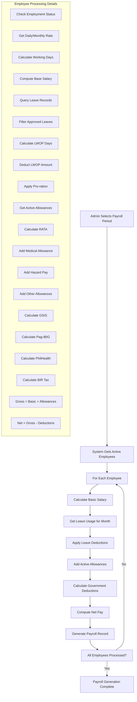

# Automated Payroll Processing Workflow

## Complete Step-by-Step Process



## Implementation Checklist

### ✅ Backend Implementation Status

1. **Period Selection** ✅
   - Validate period exists
   - Check period status (Draft only)
   - Prevent duplicate processing

2. **Employee Retrieval** ✅ 
   - Get active employees
   - Filter by appointment date
   - Order by employee number

3. **Basic Salary Calculation** ⚠️ *Partially Implemented*
   - Current: Simple daily rate × working days
   - Missing: Pro-ration logic, step increments

4. **Leave Integration** ❌ *Missing*
   - Need to query leave records
   - Calculate LWOP deductions
   - Apply pro-ration

5. **Allowances Processing** ⚠️ *Basic Implementation*
   - Current: Fixed RATA amount
   - Missing: Dynamic allowance retrieval
   - Missing: Employee-specific allowances

6. **Government Deductions** ✅
   - GSIS calculation implemented
   - Pag-IBIG calculation implemented
   - PhilHealth calculation implemented
   - BIR Tax calculation implemented

7. **Payroll Record Generation** ✅
   - Database insertion working
   - Error handling implemented
   - Status tracking functional

### 🔧 Required Enhancements

#### 1. Enhanced Leave Integration
```sql
-- Need to implement leave deduction calculation
SELECT 
    SUM(CASE WHEN lt.is_paid = 0 THEN 1 ELSE 0 END) as lwop_days
FROM leave_applications la
JOIN leave_types lt ON la.leave_type_id = lt.id
WHERE la.employee_id = ? 
    AND la.status = 'Approved'
    AND la.start_date <= ? 
    AND la.end_date >= ?
```

#### 2. Dynamic Allowance System
```sql
-- Employee-specific allowances query
SELECT at.code, at.name, ea.amount, at.is_monthly, at.is_prorated
FROM employee_allowances ea
JOIN allowance_types at ON ea.allowance_type_id = at.id
WHERE ea.employee_id = ? 
    AND ea.is_active = 1
    AND ea.effective_date <= ?
    AND (ea.end_date IS NULL OR ea.end_date >= ?)
```

#### 3. Accurate Salary Pro-ration
```javascript
const calculateProratedSalary = (monthlySalary, workingDaysInMonth, daysWorked, lwopDays) => {
    const effectiveDaysWorked = daysWorked - lwopDays;
    return (monthlySalary / workingDaysInMonth) * effectiveDaysWorked;
};
```

## ✅ **IMPLEMENTATION COMPLETE**

### **Frontend Features**
- ✅ Processing Mode Selection (All vs Individual)
- ✅ Employee Selection Dropdown
- ✅ Payroll Preview Dialog with Workflow Status
- ✅ Visual Workflow Steps Indicator
- ✅ Detailed Financial Breakdown
- ✅ Action Buttons (Preview & History)

### **Backend Implementation**
- ✅ Enhanced `generateAutomatedPayroll` endpoint
- ✅ Support for individual employee processing
- ✅ Complete workflow helper functions:
  - `calculateBasicSalary()` - Step D
  - `getLeaveUsage()` - Step E  
  - `applyLeaveDeductions()` - Step F
  - `getActiveAllowances()` - Step G
  - `calculateGovernmentDeductions()` - Step H
- ✅ Database integration with proper error handling
- ✅ Comprehensive logging and monitoring

### **Current vs Target Implementation**

### Current Implementation (Simplified)
```javascript
// Basic calculation
const basicSalary = dailyRate * workingDaysInMonth;
const totalAllowances = 2000; // Fixed RATA
const grossPay = basicSalary + totalAllowances;
```

### Target Implementation (Complete Workflow)
```javascript
// Step-by-step workflow implementation
const processEmployeePayroll = async (employee, period) => {
    // Step 1: Calculate Basic Salary
    const basicSalaryData = await calculateBasicSalary(employee, period);
    
    // Step 2: Get Leave Usage
    const leaveData = await getLeaveUsage(employee.id, period);
    
    // Step 3: Apply Leave Deductions
    const adjustedSalary = applyLeaveDeductions(basicSalaryData, leaveData);
    
    // Step 4: Add Active Allowances
    const allowances = await getActiveAllowances(employee.id, period);
    
    // Step 5: Calculate Government Deductions
    const deductions = calculateGovernmentDeductions(adjustedSalary + allowances.total);
    
    // Step 6: Compute Net Pay
    const netPay = (adjustedSalary + allowances.total) - deductions.total;
    
    return {
        employee_id: employee.id,
        basic_salary: adjustedSalary,
        total_allowances: allowances.total,
        total_deductions: deductions.total,
        gross_pay: adjustedSalary + allowances.total,
        net_pay: netPay,
        // ... additional fields
    };
};
```

## API Endpoint Flow

### Frontend Request
```javascript
POST /api/payroll-system/generate
{
    "period_id": 1,
    "employee_ids": [1, 2, 3] // Optional for individual processing
}
```

### Backend Processing Flow
1. **Validate Period** → Check status, prevent duplicates
2. **Get Employees** → Active employees or specific IDs
3. **Process Each Employee** → Complete workflow calculation
4. **Batch Insert** → Save all payroll records
5. **Update Period Status** → Mark as "Processing"
6. **Return Summary** → Processing results and statistics

## Error Handling Strategy

### Employee-Level Errors
- Continue processing other employees
- Log specific errors with employee details
- Return summary with success/failure counts

### System-Level Errors
- Rollback all changes
- Return detailed error information
- Maintain data consistency

## Performance Optimization

### Database Optimization
- Batch queries for allowances
- Efficient leave calculation queries
- Indexed employee lookups

### Processing Optimization
- Parallel employee processing (when safe)
- Cached government rate calculations
- Optimized SQL queries

## Testing Strategy

### Unit Tests
- Individual calculation functions
- Leave deduction logic
- Allowance calculation
- Government deduction formulas

### Integration Tests
- Complete payroll generation flow
- Error handling scenarios
- Database transaction integrity

### End-to-End Tests
- Frontend → Backend → Database
- User workflow validation
- Performance benchmarking