# Employee Management System (EMS) - System & Database Workflow

## Table of Contents
- [System Overview](#system-overview)
- [Architecture Diagram](#architecture-diagram)
- [Database Schema Workflow](#database-schema-workflow)
- [User Authentication Flow](#user-authentication-flow)
- [Core Module Workflows](#core-module-workflows)
- [Data Flow Diagrams](#data-flow-diagrams)
- [System Integration Points](#system-integration-points)
- [Background Job Processing](#background-job-processing)
- [Security & Audit Trail](#security--audit-trail)
- [Frontend-Backend Communication](#frontend-backend-communication)

## System Overview

The Employee Management System (EMS) is a comprehensive Human Resource Information System (HRIS) designed for managing employee records, leave management, payroll processing, training records, benefits administration, and terminal leave benefits calculation.

### Key Features
- **Employee Management**: Complete employee lifecycle management
- **Leave Management**: Automated leave accrual, applications, and approvals
- **Payroll System**: Salary management, allowances, and deductions
- **Training Management**: Training programs and employee training records
- **Document Management**: Employee document upload and approval workflow
- **Benefits Administration**: Compensation and benefits tracking
- **Terminal Leave Benefits**: Automated TLB calculation for separating employees
- **Audit Trail**: Comprehensive logging of all system activities

### Technology Stack
- **Frontend**: React + TypeScript + Vite + Tailwind CSS
- **Backend**: Node.js + Express.js
- **Database**: MySQL 8.0
- **Authentication**: Session-based with bcrypt
- **File Storage**: Local file system with Express-fileupload
- **Scheduled Jobs**: Node-cron for automated tasks

## Architecture Diagram

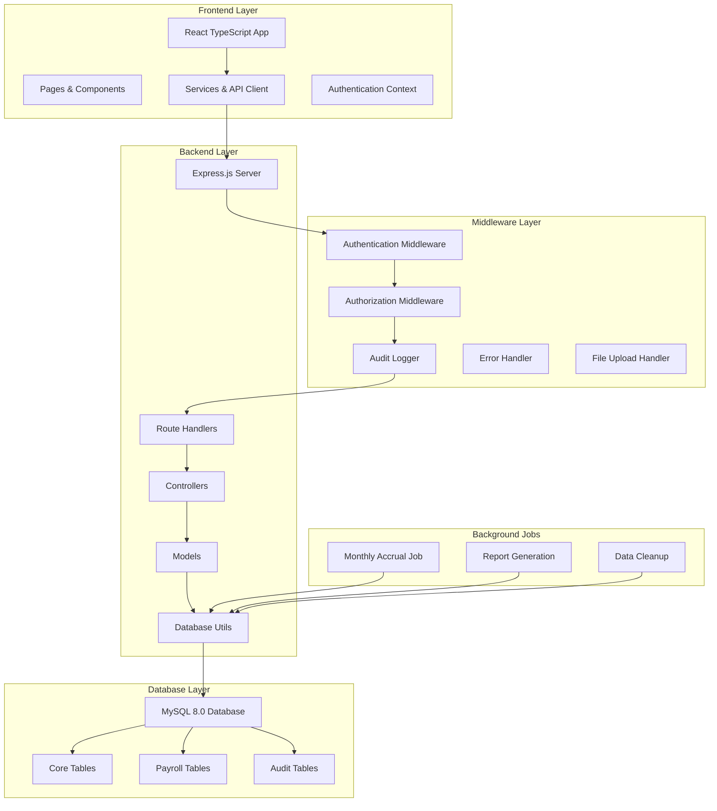

## Database Schema Workflow

### Core Database Tables Structure

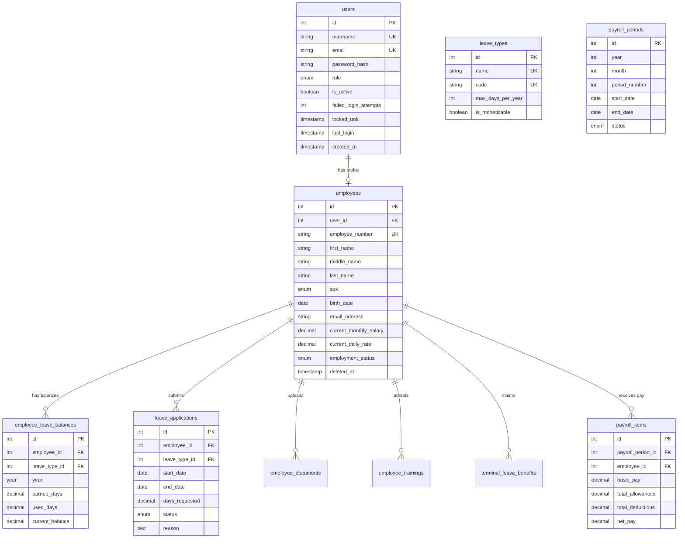

### Table Relationships & Constraints

1. **One-to-One Relationships**
   - `users` ↔ `employees` (Optional: employees can exist without user accounts)

2. **One-to-Many Relationships**
   - `employees` → `employee_leave_balances`
   - `employees` → `leave_applications`
   - `employees` → `employee_documents`
   - `employees` → `employee_trainings`
   - `payroll_periods` → `payroll_items`

3. **Foreign Key Constraints**
   - All foreign keys include CASCADE DELETE for child records
   - Audit logs maintain referential integrity

## User Authentication Flow

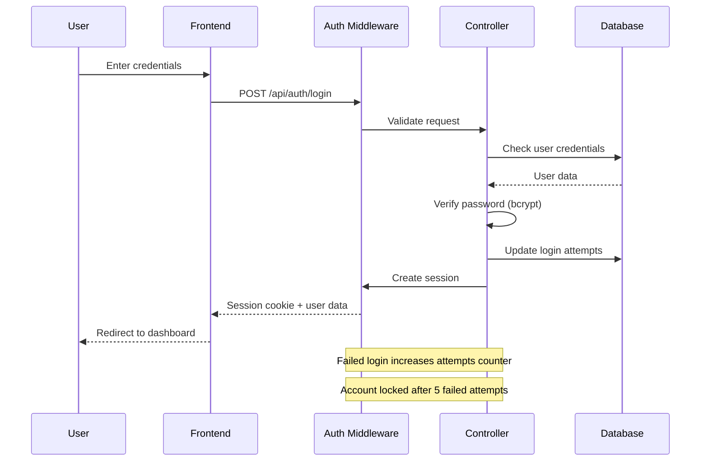

### Session Management
- **Session Duration**: 8 hours
- **Security Features**: HTTPOnly cookies, SameSite protection
- **Account Lockout**: 5 failed attempts = 15-minute lockout
- **Role-based Access**: Admin vs Employee permissions

## Core Module Workflows

### 1. Employee Management Workflow

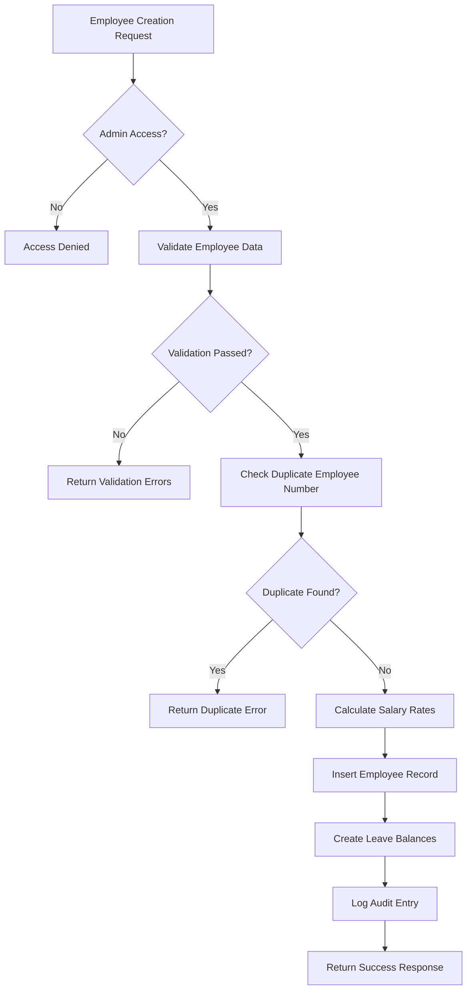

**Key Features:**
- Automatic salary rate calculation (22-day month rule)
- Soft delete implementation with restore capability
- Comprehensive validation with business rules
- Automatic leave balance initialization

### 2. Leave Management Workflow

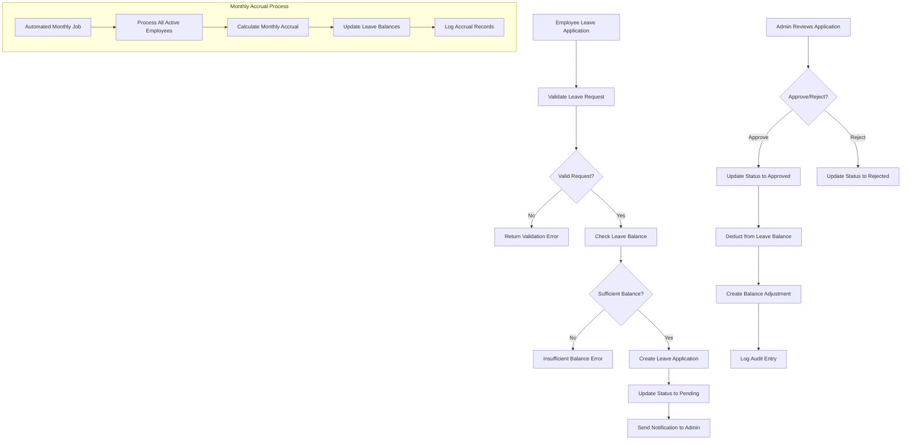

**Accrual Rules:**
- **Vacation Leave**: 1.25 days per month (15 days/year)
- **Sick Leave**: 1.25 days per month (15 days/year)
- **Automatic Processing**: 1st of each month at 2:00 AM

### 3. Payroll Processing Workflow

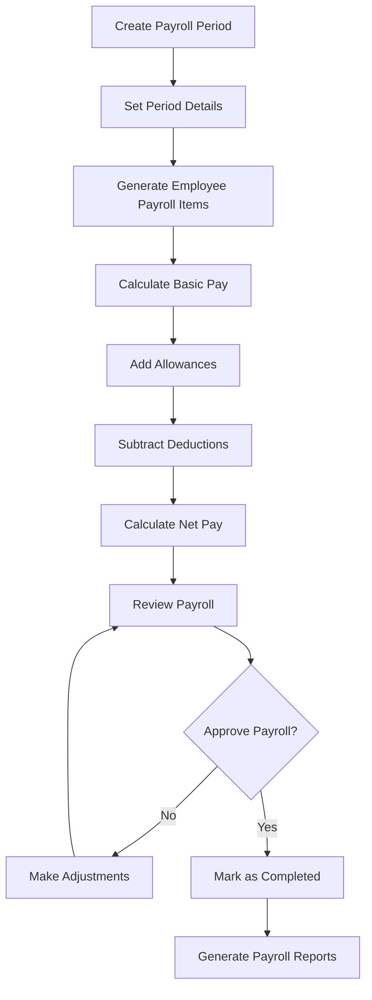

**Payroll Components:**
- **Basic Pay**: Monthly salary or daily rate × working days
- **Allowances**: Transportation, meal, housing allowances
- **Deductions**: SSS, PhilHealth, Pag-IBIG, tax, loans
- **Period Types**: 1st half (1-15th) and 2nd half (16th-end) of month

### 4. Training Management Workflow

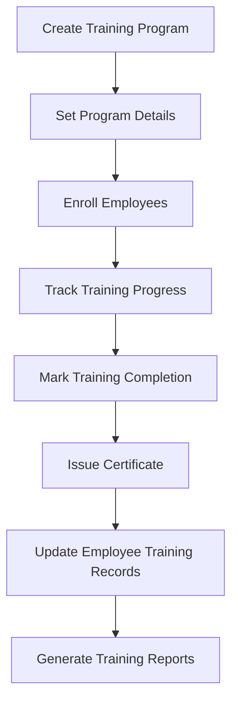

### 5. Terminal Leave Benefits (TLB) Workflow

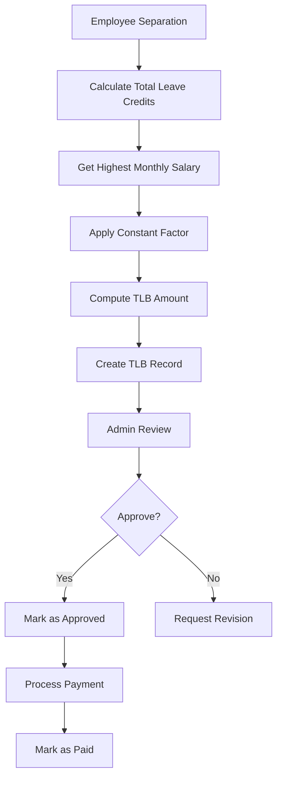

**TLB Calculation Formula:**
```
TLB Amount = Total Leave Credits × Highest Monthly Salary × Constant Factor (1.00)
```

## Data Flow Diagrams

### Employee CRUD Operations

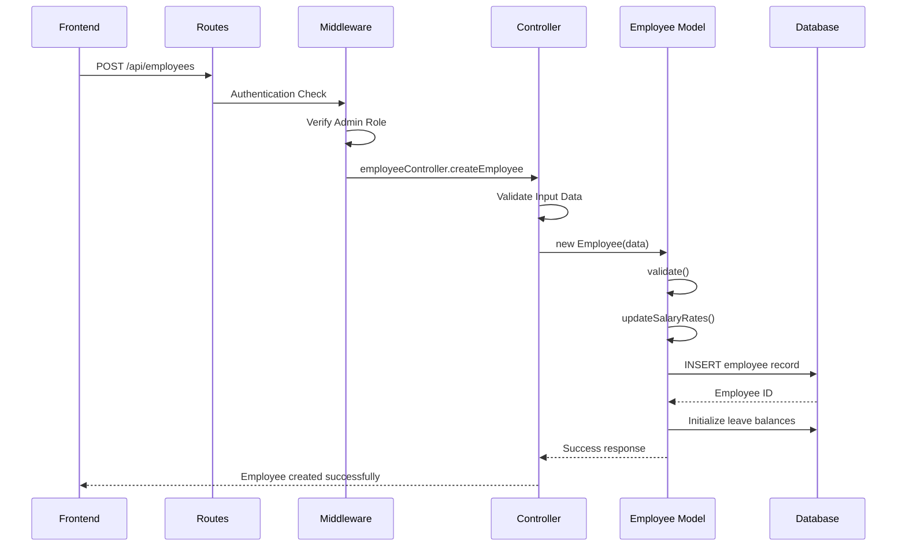

### Leave Application Process

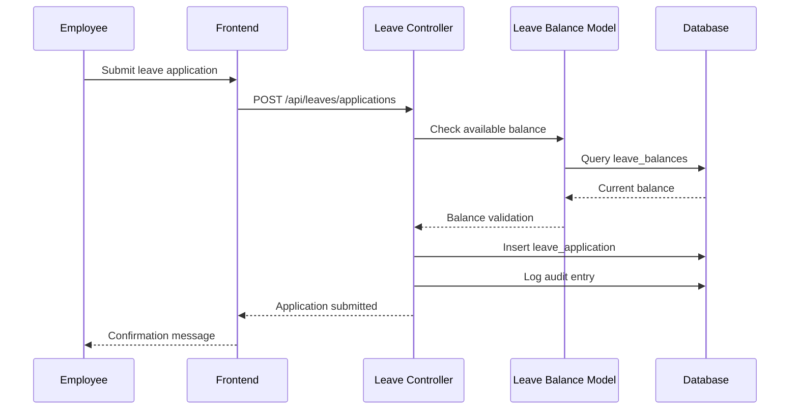

## System Integration Points

### 1. Authentication Integration
- Session-based authentication with Express sessions
- Role-based access control (Admin/Employee)
- Account lockout mechanism
- Password strength validation

### 2. File Upload Integration
- Document upload for employee records
- File type validation and size limits
- Secure file storage with organized directory structure
- Document approval workflow

### 3. Audit Trail Integration
- Automatic logging of all database modifications
- User action tracking with IP and timestamp
- Before/after value comparison for updates
- Comprehensive audit report generation

### 4. Email Integration (Planned)
- Leave application notifications
- Payroll distribution alerts
- Training program notifications
- System alerts and maintenance notices

## Background Job Processing

### Monthly Leave Accrual Job

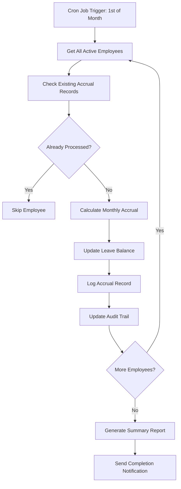

**Job Configuration:**
- **Schedule**: 1st of each month at 2:00 AM (Asia/Manila timezone)
- **Safety Features**: Idempotent processing, duplicate prevention
- **Monitoring**: Status tracking, error logging, processing history

## Security & Audit Trail

### Security Measures

1. **Authentication Security**
   - bcrypt password hashing (12 rounds)
   - Session-based authentication
   - Account lockout after failed attempts
   - Password strength validation

2. **Authorization Security**
   - Role-based access control
   - Resource-level permissions
   - Owner-based data access

3. **Data Security**
   - SQL injection prevention with parameterized queries
   - Input validation and sanitization
   - File upload security with type validation
   - Soft delete for data preservation

### Audit Trail System

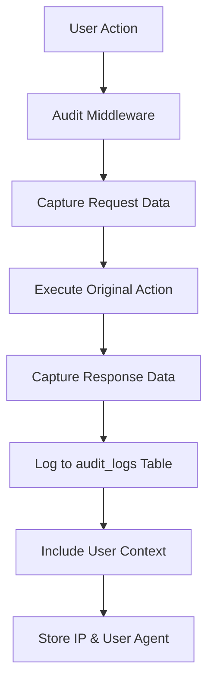

**Audit Log Fields:**
- User ID and action performed
- Table name and record ID affected
- Before and after values (JSON)
- IP address and user agent
- Timestamp and session information

## Frontend-Backend Communication

### API Communication Pattern

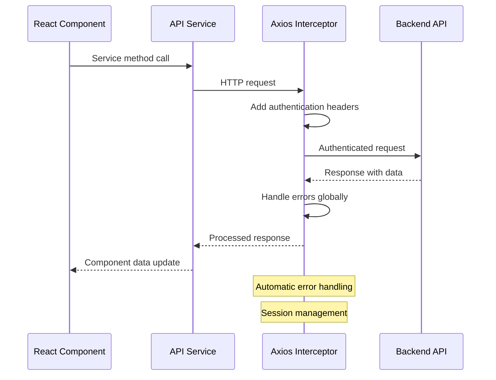

### State Management Flow

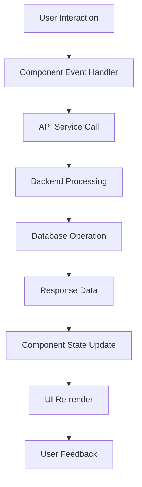

### Frontend Routing Structure

```
/                          → Login Page
/dashboard                 → Main Dashboard
/employees                 → Employee List (Admin)
/employees/:id             → Employee Profile
/employees/:id/edit        → Employee Edit Form (Admin)
/leaves                    → Leave Management
/leaves/applications       → My Leave Applications
/leaves/admin              → Admin Leave Management
/training                  → Training Management
/training/programs         → Training Programs
/payroll                   → Payroll Management (Admin)
/benefits                  → Benefits Administration
/tlb                       → Terminal Leave Benefits
/profile                   → User Profile
/admin                     → Admin Panel
```

## Error Handling & Recovery

### Error Handling Strategy

1. **Frontend Error Handling**
   - Global error boundary for React components
   - API error interceptors with user-friendly messages
   - Form validation with real-time feedback
   - Loading states and error recovery options

2. **Backend Error Handling**
   - Global error handler middleware
   - Structured error responses
   - Database transaction rollback
   - Comprehensive error logging

3. **Database Error Recovery**
   - Connection pool management
   - Automatic reconnection handling
   - Transaction safety with rollback
   - Data validation before operations

### System Monitoring

- **Performance Monitoring**: Response time tracking
- **Error Monitoring**: Error rate and frequency analysis
- **Audit Monitoring**: Security event detection
- **Resource Monitoring**: Database performance metrics

## Deployment & Configuration

### Environment Configuration

```javascript
// Production Configuration
DB_HOST=localhost
DB_PORT=3306
DB_USER=ems_user
DB_PASSWORD=secure_password
DB_NAME=employee_management_system
SESSION_SECRET=production_session_secret
NODE_ENV=production
PORT=3000
```

### Database Optimization

1. **Indexing Strategy**
   - Primary keys on all tables
   - Foreign key indexes for relationships
   - Composite indexes for frequent queries
   - Search indexes for text fields

2. **Performance Optimization**
   - Connection pooling (max 10 connections)
   - Query optimization with proper joins
   - Pagination for large result sets
   - Caching for frequently accessed data

---

## Summary

The Employee Management System (EMS) provides a comprehensive solution for human resource management with:

- **Robust Architecture**: Layered design with clear separation of concerns
- **Complete CRUD Operations**: Full employee lifecycle management
- **Automated Processes**: Leave accrual, payroll processing, and report generation
- **Security & Compliance**: Comprehensive audit trail and role-based access
- **Modern Frontend**: React-based responsive user interface
- **Scalable Backend**: Node.js with optimized database operations

The system is designed for reliability, maintainability, and scalability, making it suitable for organizations of various sizes requiring comprehensive employee management capabilities.