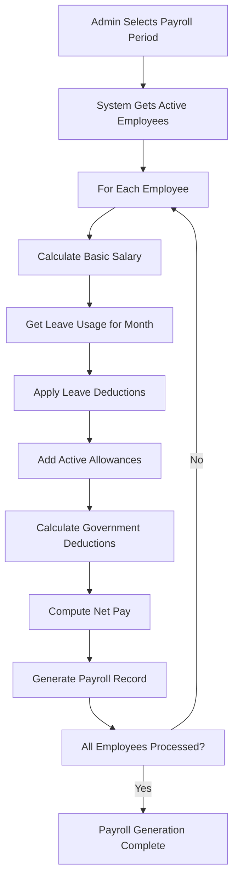
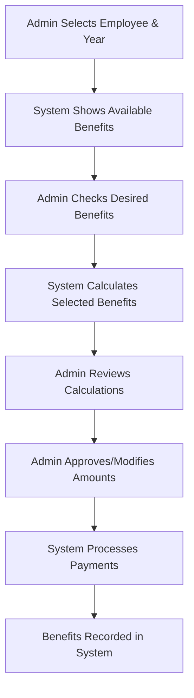

I'll create a comprehensive workflow and plan to update the payroll and compensation & benefits system based on your requirements. Let me first analyze the current system structure and then create the update plan.

```toolCall::search_codebase
```


```toolCall::search_codebase
```

I'll create a comprehensive workflow and plan to restructure your EMS system to properly separate Payroll from Compensation & Benefits. Let me first understand the current system structure and then create the markdown plan.

```toolCall::list_dir
```


```toolCall::search_codebase
```

Now let me examine the current benefits and compensation system structure:

```toolCall::search_codebase
```

Based on my analysis of the current EMS system, I'll create a comprehensive workflow and plan to restructure the Payroll and Compensation & Benefits systems according to your specifications.

# EMS System Restructuring: Payroll vs Compensation & Benefits

## Executive Summary

This document outlines the complete restructuring of the Employee Management System to properly separate **Automated Payroll Processing** from **Manual Compensation & Benefits Selection**. The current system incorrectly combines these two distinct functions, which need to be separated for proper workflow management.

---

## Current System Analysis

### Existing Problems
1. **Mixed Functionality**: Current benefits controller handles both payroll items and compensation benefits
2. **Inconsistent Processing**: Some items are automated while others require manual selection
3. **Database Structure**: Tables need reorganization to separate payroll from compensation
4. **UI Confusion**: Current interface doesn't distinguish between automated vs manual processes

### Current Database Tables
- `payroll_items` - Contains payroll calculations
- `employee_compensation` - Mixed use for both payroll and benefits
- `compensation_types` - Mixed types for both systems
- `benefits_types` - Separate table that needs integration

---

## System Restructuring Plan

## Phase 1: Database Schema Redesign

### 1.1 New Payroll System Tables

```sql
-- Dedicated payroll allowances configuration
CREATE TABLE `payroll_allowance_types` (
  [id](file://c:\Users\PC\Documents\EMS-SYSTEM\frontend\src\types\payroll.ts#L18-L18) int PRIMARY KEY AUTO_INCREMENT,
  [code](file://c:\Users\PC\Documents\EMS-SYSTEM\frontend\src\types\payroll.ts#L293-L293) varchar(20) UNIQUE NOT NULL,
  [name](file://c:\Users\PC\Documents\EMS-SYSTEM\frontend\src\types\payroll.ts#L294-L294) varchar(100) NOT NULL,
  [description](file://c:\Users\PC\Documents\EMS-SYSTEM\frontend\src\types\payroll.ts#L295-L295) text,
  `is_active` boolean DEFAULT true,
  [created_at](file://c:\Users\PC\Documents\EMS-SYSTEM\frontend\src\types\payroll.ts#L45-L45) timestamp DEFAULT CURRENT_TIMESTAMP
);

-- Employee-specific payroll allowance rates
CREATE TABLE `employee_payroll_allowances` (
  [id](file://c:\Users\PC\Documents\EMS-SYSTEM\frontend\src\types\payroll.ts#L18-L18) int PRIMARY KEY AUTO_INCREMENT,
  [employee_id](file://c:\Users\PC\Documents\EMS-SYSTEM\frontend\src\types\payroll.ts#L19-L19) int NOT NULL,
  `allowance_type_id` int NOT NULL,
  [amount](file://c:\Users\PC\Documents\EMS-SYSTEM\frontend\src\types\payroll.ts#L305-L305) decimal(12,2) NOT NULL,
  [effective_date](file://c:\Users\PC\Documents\EMS-SYSTEM\frontend\src\types\payroll.ts#L110-L110) date NOT NULL,
  [end_date](file://c:\Users\PC\Documents\EMS-SYSTEM\frontend\src\types\payroll.ts#L7-L7) date NULL,
  `is_active` boolean DEFAULT true,
  [created_at](file://c:\Users\PC\Documents\EMS-SYSTEM\frontend\src\types\payroll.ts#L45-L45) timestamp DEFAULT CURRENT_TIMESTAMP,
  FOREIGN KEY ([employee_id](file://c:\Users\PC\Documents\EMS-SYSTEM\frontend\src\types\payroll.ts#L19-L19)) REFERENCES [employees](file://c:\Users\PC\Documents\EMS-SYSTEM\frontend\src\types\employee.ts#L93-L93)([id](file://c:\Users\PC\Documents\EMS-SYSTEM\frontend\src\types\payroll.ts#L18-L18)),
  FOREIGN KEY (`allowance_type_id`) REFERENCES `payroll_allowance_types`([id](file://c:\Users\PC\Documents\EMS-SYSTEM\frontend\src\types\payroll.ts#L18-L18))
);

-- Enhanced payroll items table
ALTER TABLE `payroll_items` 
ADD COLUMN `leave_days_deducted` decimal(4,2) DEFAULT 0.00,
ADD COLUMN `working_days_in_month` decimal(4,2) DEFAULT 22.00,
ADD COLUMN `salary_adjustment` decimal(10,2) DEFAULT 0.00;
```

### 1.2 Compensation & Benefits System Tables

```sql
-- Dedicated compensation & benefits types
CREATE TABLE `cb_benefit_types` (
  [id](file://c:\Users\PC\Documents\EMS-SYSTEM\frontend\src\types\payroll.ts#L18-L18) int PRIMARY KEY AUTO_INCREMENT,
  [code](file://c:\Users\PC\Documents\EMS-SYSTEM\frontend\src\types\payroll.ts#L293-L293) varchar(20) UNIQUE NOT NULL,
  [name](file://c:\Users\PC\Documents\EMS-SYSTEM\frontend\src\types\payroll.ts#L294-L294) varchar(100) NOT NULL,
  [description](file://c:\Users\PC\Documents\EMS-SYSTEM\frontend\src\types\payroll.ts#L295-L295) text,
  [category](file://c:\Users\PC\Documents\EMS-SYSTEM\frontend\src\pages\BenefitsPage.tsx#L137-L137) enum('BONUS', 'ALLOWANCE', 'AWARD', 'MONETIZATION', 'INSURANCE', 'CLAIM') NOT NULL,
  `frequency` enum('YEARLY', 'CONDITIONAL', 'ONE_TIME') NOT NULL,
  `calculation_method` enum('FIXED', 'PERCENTAGE', 'FORMULA') DEFAULT 'FIXED',
  `base_amount` decimal(12,2) DEFAULT 0.00,
  [is_taxable](file://c:\Users\PC\Documents\EMS-SYSTEM\frontend\src\types\payroll.ts#L297-L297) boolean DEFAULT true,
  `is_active` boolean DEFAULT true,
  `eligibility_rules` json,
  [created_at](file://c:\Users\PC\Documents\EMS-SYSTEM\frontend\src\types\payroll.ts#L45-L45) timestamp DEFAULT CURRENT_TIMESTAMP
);

-- Employee benefit selections (manual checkbox system)
CREATE TABLE `employee_benefit_selections` (
  [id](file://c:\Users\PC\Documents\EMS-SYSTEM\frontend\src\types\payroll.ts#L18-L18) int PRIMARY KEY AUTO_INCREMENT,
  [employee_id](file://c:\Users\PC\Documents\EMS-SYSTEM\frontend\src\types\payroll.ts#L19-L19) int NOT NULL,
  `benefit_type_id` int NOT NULL,
  [year](file://c:\Users\PC\Documents\EMS-SYSTEM\frontend\src\types\payroll.ts#L3-L3) year NOT NULL,
  `is_selected` boolean DEFAULT false,
  [calculated_amount](file://c:\Users\PC\Documents\EMS-SYSTEM\frontend\src\types\payroll.ts#L358-L358) decimal(12,2) DEFAULT 0.00,
  `actual_amount` decimal(12,2) DEFAULT 0.00,
  [status](file://c:\Users\PC\Documents\EMS-SYSTEM\frontend\src\types\payroll.ts#L9-L9) enum('PENDING', 'CALCULATED', 'APPROVED', 'PAID', 'CANCELLED') DEFAULT 'PENDING',
  `selection_date` timestamp DEFAULT CURRENT_TIMESTAMP,
  `processed_by` int NULL,
  `processed_date` timestamp NULL,
  [notes](file://c:\Users\PC\Documents\EMS-SYSTEM\frontend\src\types\payroll.ts#L310-L310) text,
  FOREIGN KEY ([employee_id](file://c:\Users\PC\Documents\EMS-SYSTEM\frontend\src\types\payroll.ts#L19-L19)) REFERENCES [employees](file://c:\Users\PC\Documents\EMS-SYSTEM\frontend\src\types\employee.ts#L93-L93)([id](file://c:\Users\PC\Documents\EMS-SYSTEM\frontend\src\types\payroll.ts#L18-L18)),
  FOREIGN KEY (`benefit_type_id`) REFERENCES `cb_benefit_types`([id](file://c:\Users\PC\Documents\EMS-SYSTEM\frontend\src\types\payroll.ts#L18-L18)),
  FOREIGN KEY (`processed_by`) REFERENCES `users`([id](file://c:\Users\PC\Documents\EMS-SYSTEM\frontend\src\types\payroll.ts#L18-L18))
);
```

### 1.3 Data Migration Scripts

```sql
-- Insert payroll allowance types
INSERT INTO payroll_allowance_types (code, name, description) VALUES
('SALARY', 'Basic Salary', 'Monthly basic salary'),
('RATA', 'Representation & Transportation Allowance', 'Fixed monthly RATA allowance'),
('CA', 'Clothing Allowance', 'Annual clothing allowance'),
('MA', 'Medical Allowance', 'Monthly medical allowance'),
('SLA', 'Subsistence & Laundry Allowance', 'Monthly subsistence and laundry allowance'),
('HA', 'Hazard Allowance', 'Monthly hazard pay allowance');

-- Insert compensation & benefits types
INSERT INTO cb_benefit_types (code, name, category, frequency, description) VALUES
('VLM', 'Vacation Leave Monetization', 'MONETIZATION', 'CONDITIONAL', 'Monetization of unused vacation leave credits'),
('SLM', 'Sick Leave Monetization', 'MONETIZATION', 'CONDITIONAL', 'Monetization of unused sick leave credits'),
('PBB', 'Performance-Based Bonus', 'BONUS', 'YEARLY', 'Annual performance-based bonus'),
('MYB', 'Mid-Year Bonus (13th Month)', 'BONUS', 'YEARLY', '13th month pay bonus'),
('YEB', 'Year-End Bonus (14th Month)', 'BONUS', 'YEARLY', '14th month pay bonus'),
('EC', 'Employee Compensation', 'INSURANCE', 'CONDITIONAL', 'Insurance and work-related claims'),
('GSIS', 'GSIS Benefits', 'INSURANCE', 'CONDITIONAL', 'Government Service Insurance System benefits'),
('LA', 'Loyalty Award', 'AWARD', 'CONDITIONAL', 'Long service loyalty award');
```

---

## Phase 2: Backend API Restructuring

### 2.1 New Payroll System Controllers

```javascript
// controllers/payrollSystemController.js
class PayrollSystemController {
  // Automated payroll computation
  async generatePayroll(req, res) {
    const { period_id } = req.body;
    
    // 1. Get all active employees
    // 2. For each employee:
    //    a. Calculate basic salary (monthly_salary / 22 * working_days)
    //    b. Get leave usage for the month
    //    c. Apply leave deductions
    //    d. Add all active allowances (RATA, Medical, etc.)
    //    e. Calculate deductions (GSIS, Pag-IBIG, PhilHealth, Tax)
    // 3. Generate payroll_items records automatically
  }
  
  // Update employee allowance rates
  async updateEmployeeAllowances(req, res) {
    // Update individual allowance amounts for employees
  }
  
  // Get payroll computation details
  async getPayrollComputation(req, res) {
    // Show how payroll was computed with leave deductions
  }
}
```

### 2.2 New Compensation & Benefits Controllers

```javascript
// controllers/compensationBenefitsController.js
class CompensationBenefitsController {
  // Get available benefits for employee selection
  async getAvailableBenefits(req, res) {
    const { employee_id, year } = req.params;
    
    // 1. Get all active benefit types
    // 2. Check eligibility for each benefit
    // 3. Get current selections for the year
    // 4. Return with checkbox status
  }
  
  // Manual benefit selection (checkbox system)
  async selectBenefits(req, res) {
    const { employee_id, selected_benefits, year } = req.body;
    
    // 1. Validate benefit selections
    // 2. Calculate amounts for selected benefits
    // 3. Create/update employee_benefit_selections records
    // 4. Set status to 'CALCULATED'
  }
  
  // Process selected benefits
  async processBenefits(req, res) {
    // 1. Get all CALCULATED benefits for processing
    // 2. Generate payment records
    // 3. Update status to 'PAID'
  }
}
```

### 2.3 API Route Structure

```javascript
// routes/payrollSystem.js
router.post('/generate', payrollSystemController.generatePayroll);
router.get('/computation/:period_id', payrollSystemController.getPayrollComputation);
router.put('/allowances/:employee_id', payrollSystemController.updateEmployeeAllowances);

// routes/compensationBenefits.js
router.get('/available/:employee_id/:year', cbController.getAvailableBenefits);
router.post('/select', cbController.selectBenefits);
router.post('/process', cbController.processBenefits);
router.get('/selections/:employee_id/:year', cbController.getBenefitSelections);
```

---

## Phase 3: Frontend UI Restructuring

### 3.1 Payroll System Interface

```typescript
// pages/PayrollSystemPage.tsx
interface PayrollSystemPage {
  // Automated payroll generation interface
  // - Select payroll period
  // - View employee list with computed amounts
  // - Show leave deduction calculations
  // - Generate payroll automatically
  // - No manual selection required
}

// components/PayrollComputationView.tsx
interface PayrollComputationView {
  // Show detailed computation breakdown:
  // - Basic salary calculation
  // - Working days vs leave days
  // - Allowance amounts
  // - Deduction calculations
  // - Net pay computation
}
```

### 3.2 Compensation & Benefits Interface

```typescript
// pages/CompensationBenefitsPage.tsx
interface CompensationBenefitsPage {
  // Manual benefit selection interface
  // - Employee selector
  // - Year selector
  // - Checkbox list of available benefits
  // - Calculate selected benefits
  // - Process payments
}

// components/BenefitSelectionForm.tsx
interface BenefitSelectionForm {
  benefitCategories: {
    bonuses: BenefitType[];      // PBB, 13th, 14th Month
    monetization: BenefitType[]; // Leave monetization
    awards: BenefitType[];       // Loyalty awards
    insurance: BenefitType[];    // EC, GSIS
  };
  selectedBenefits: number[];
  onBenefitToggle: (benefitId: number) => void;
  onCalculate: () => void;
  onProcess: () => void;
}
```

---

## Phase 4: Implementation Workflow

### Step 1: Database Migration (Week 1)
1. Create new tables for payroll allowances and benefit types
2. Migrate existing data to new structure
3. Update foreign key constraints
4. Create database indexes for performance

### Step 2: Backend Development (Week 2-3)
1. Develop new payroll system controller
2. Develop compensation & benefits controller
3. Create new API routes
4. Implement automated payroll computation logic
5. Implement manual benefit selection logic
6. Add validation and error handling

### Step 3: Frontend Development (Week 3-4)
1. Create payroll system interface
2. Create compensation & benefits interface
3. Implement automated payroll generation UI
4. Implement manual benefit selection UI
5. Add calculation and processing workflows

### Step 4: Testing & Integration (Week 4-5)
1. Unit testing for all new components
2. Integration testing between systems
3. User acceptance testing
4. Performance optimization
5. Data validation and cleanup

### Step 5: Deployment & Training (Week 5-6)
1. Production deployment
2. User training on new workflows
3. Documentation updates
4. System monitoring and support

---

## System Workflows

### Payroll System Workflow (Automated)



### Compensation & Benefits Workflow (Manual)



---

## Technical Specifications

### Backend Architecture Changes

1. **Separation of Concerns**
   - `PayrollSystemService` - Handles automated computations
   - `CompensationBenefitsService` - Handles manual selections
   - `LeaveCalculationService` - Calculates leave deductions
   - `AllowanceManagementService` - Manages payroll allowances

2. **Database Optimization**
   - Indexed tables for performance
   - Proper foreign key relationships
   - Audit trail for all changes
   - Data validation constraints

3. **API Design**
   - RESTful endpoints for each system
   - Clear separation between payroll and benefits
   - Proper error handling and validation
   - Role-based access control

### Frontend Architecture Changes

1. **Component Structure**
   - Separate page components for each system
   - Reusable calculation components
   - Form validation components
   - Data visualization components

2. **State Management**
   - Separate state for payroll and benefits
   - Proper data flow between components
   - Error state handling
   - Loading state management

3. **User Experience**
   - Clear workflow separation
   - Intuitive checkbox interface for benefits
   - Automated calculation displays
   - Progress indicators

---

## Benefits of the New System

### For Administrators
1. **Clear Workflow Separation** - No confusion between automated payroll and manual benefits
2. **Improved Efficiency** - Automated payroll computation saves time
3. **Better Control** - Manual selection of benefits with proper approval workflow
4. **Accurate Calculations** - Automated leave deduction calculations
5. **Audit Trail** - Complete tracking of all selections and approvals

### For Employees
1. **Transparent Process** - Clear understanding of payroll vs benefits
2. **Accurate Pay** - Proper leave deduction calculations
3. **Benefit Visibility** - Can see available benefits and eligibility

### For System Maintenance
1. **Modular Design** - Easy to maintain and update each system separately
2. **Scalable Architecture** - Can add new benefit types or payroll components easily
3. **Data Integrity** - Proper database design ensures data consistency
4. **Performance** - Optimized queries and indexed tables

---

## Implementation Timeline

| Week | Phase | Tasks | Deliverables |
|------|-------|-------|--------------|
| 1 | Database Migration | Schema design, table creation, data migration | New database structure |
| 2 | Backend Development | API development, business logic implementation | Working API endpoints |
| 3 | Frontend Development | UI components, workflow implementation | Working user interfaces |
| 4 | Integration Testing | System testing, bug fixes, optimization | Tested system |
| 5 | Deployment | Production deployment, user training | Live system |
| 6 | Support | Monitoring, support, documentation | Stable operation |

This restructuring will provide a clear, efficient, and maintainable system that properly separates automated payroll processing from manual compensation & benefits selection, addressing all the requirements you've outlined.