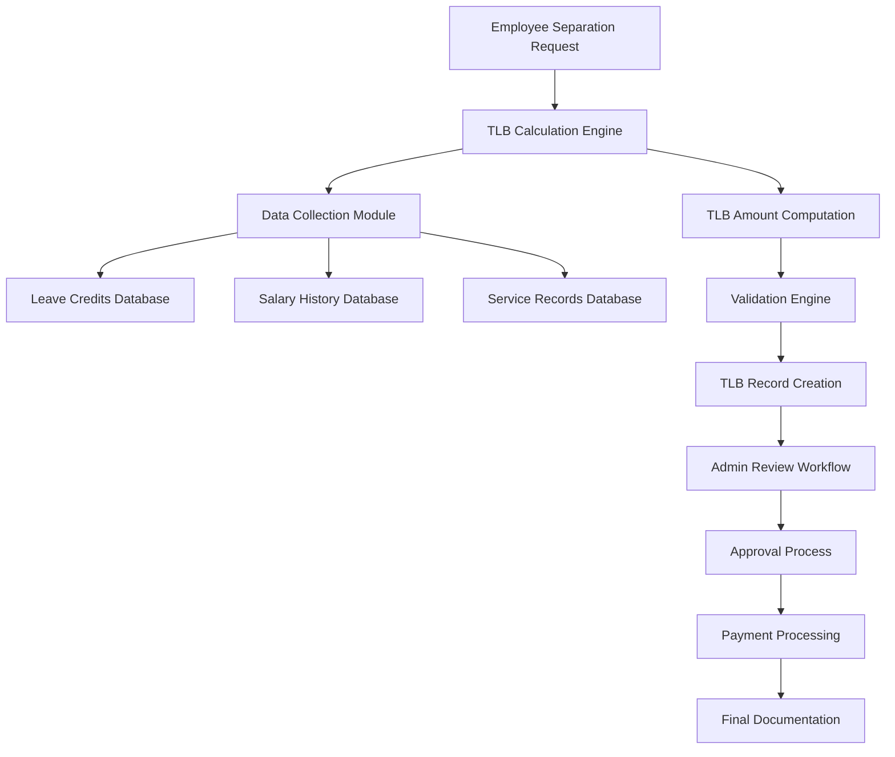
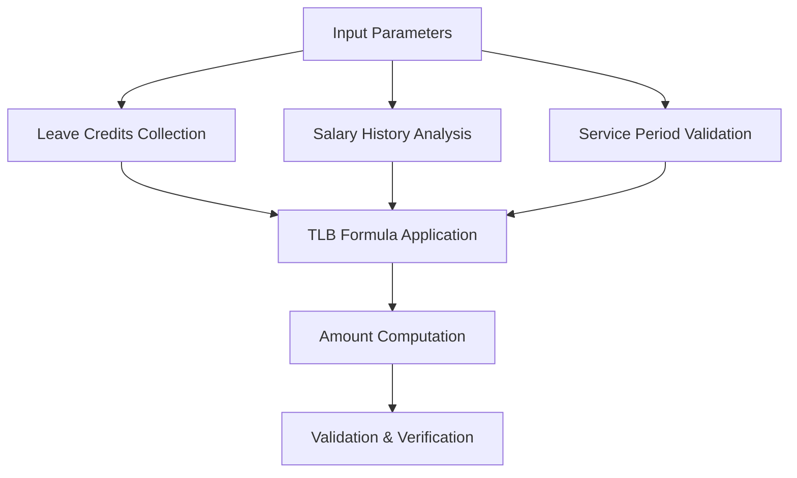
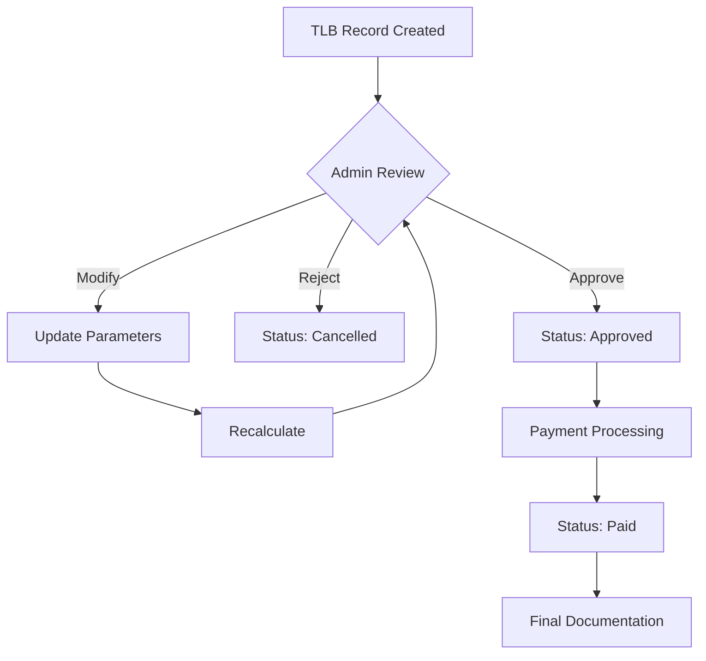
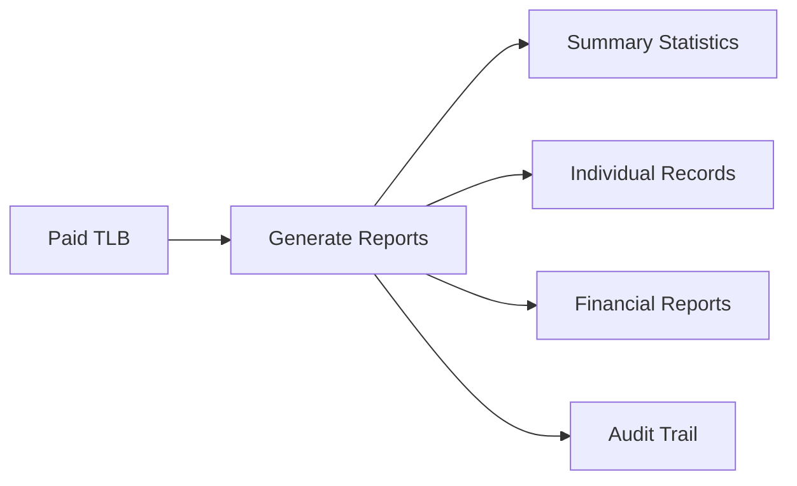
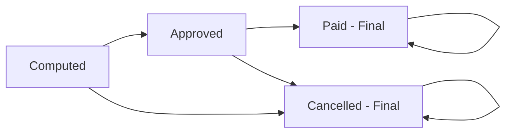

# Terminal Leave Benefits (TLB) System Workflow

## Overview
The Terminal Leave Benefits (TLB) system is a comprehensive module designed to calculate, manage, and track terminal leave benefits for employees upon separation from service. The system automates the complex calculation process and provides workflow management for processing TLB claims.

## Table of Contents
1. [System Architecture](#system-architecture)
2. [Core Workflow](#core-workflow)
3. [Calculation Formula](#calculation-formula)
4. [User Roles and Permissions](#user-roles-and-permissions)
5. [TLB Lifecycle States](#tlb-lifecycle-states)
6. [API Endpoints](#api-endpoints)
7. [Database Schema](#database-schema)
8. [Business Rules](#business-rules)
9. [Security Features](#security-features)
10. [Error Handling](#error-handling)
11. [Testing and Validation](#testing-and-validation)

---

## System Architecture



---

## Core Workflow

### 1. **Initiation Phase**


**Steps:**
1. Employee submits separation request or HR initiates separation process
2. System validates employee eligibility for TLB
3. Admin accesses TLB calculation module
4. System collects required data automatically

### 2. **Calculation Phase**


**Steps:**
1. **Data Collection:**
   - Total accumulated leave credits
   - Highest monthly salary during service
   - Constant factor (system configurable, default: 1.0)
   - Separation date and claim date

2. **Automatic Calculation:**
   - System applies TLB formula
   - Validates calculation parameters
   - Generates computed amount

### 3. **Processing Workflow**


**Status Flow:**
- **Computed** → **Approved** → **Paid**
- **Computed** → **Cancelled** (if rejected)
- **Approved** → **Cancelled** (before payment)

### 4. **Documentation & Reporting**


---

## Calculation Formula

### **Primary Formula:**
```
TLB Amount = Total Leave Credits × Highest Monthly Salary × Constant Factor
```

### **Component Details:**

#### 1. **Total Leave Credits**
- Source: `employee_leave_balances` table
- Calculation: `SUM(earned_days) - SUM(used_days) - SUM(monetized_days)`
- Includes all leave types accumulated during service

#### 2. **Highest Monthly Salary**
- Sources: 
  - `service_records.salary` (historical data)
  - `employees.current_monthly_salary` (current salary)
- System selects the maximum value from both sources

#### 3. **Constant Factor**
- Default: 1.0
- Configurable through `system_settings` table
- Setting key: `tlb_constant_factor`
- Range: 0.1 to 2.0

### **Example Calculation:**
```
Employee: John Doe
Total Leave Credits: 45.50 days
Highest Monthly Salary: ₱35,000.00
Constant Factor: 1.0

TLB Amount = 45.50 × 35,000.00 × 1.0 = ₱1,592,500.00
```

---

## User Roles and Permissions

### **Administrator Role**
- ✅ View all TLB records
- ✅ Create new TLB records
- ✅ Update TLB records (status, payment details)
- ✅ Delete TLB records (except paid records)
- ✅ Generate reports and statistics
- ✅ Access all calculation tools
- ✅ Manage system settings

### **Employee Role**
- ✅ View own TLB record only
- ✅ Calculate potential TLB amount
- ❌ Create/modify TLB records
- ❌ Access other employees' records
- ❌ Generate system reports

---

## TLB Lifecycle States

### **State Definitions:**

#### 1. **Computed**
- **Description:** Initial state after TLB calculation
- **Characteristics:**
  - Amount calculated but not yet reviewed
  - Can be modified by admin
  - Awaiting approval decision

#### 2. **Approved**
- **Description:** Admin has reviewed and approved the TLB
- **Characteristics:**
  - Ready for payment processing
  - Can still be cancelled before payment
  - Requires payment details for completion

#### 3. **Paid**
- **Description:** TLB amount has been disbursed
- **Characteristics:**
  - Final state - cannot be modified
  - Cannot be deleted
  - Payment date and check number recorded

#### 4. **Cancelled**
- **Description:** TLB claim rejected or cancelled
- **Characteristics:**
  - Can be cancelled from any previous state
  - Requires admin action
  - Can include cancellation notes

### **State Transition Rules:**


---

## API Endpoints

### **Core CRUD Operations**

#### **1. Get All TLB Records**
```http
GET /api/tlb
Query Parameters:
- page: Page number (default: 1)
- limit: Records per page (default: 10, max: 100)
- status: Filter by status
- employee_id: Filter by employee (admin only)
- year: Filter by claim year
- search: Search by employee name/number
- sort_by: Sort field (claim_date, computed_amount, status)
- sort_order: ASC or DESC
```

#### **2. Get TLB Statistics**
```http
GET /api/tlb/statistics
Query Parameters:
- year: Filter statistics by year
```

#### **3. Calculate TLB for Employee**
```http
GET /api/tlb/employee/:employeeId/calculation
Query Parameters:
- separationDate: Employee separation date (required)
- claimDate: TLB claim date (required)
```

#### **4. Create TLB Record**
```http
POST /api/tlb
Body:
{
  "employee_id": number,
  "total_leave_credits": number,
  "highest_monthly_salary": number,
  "constant_factor": number (optional, default: 1.0),
  "claim_date": "YYYY-MM-DD",
  "separation_date": "YYYY-MM-DD",
  "notes": string (optional)
}
```

#### **5. Update TLB Record**
```http
PUT /api/tlb/:id
Body:
{
  "status": "Computed|Approved|Paid|Cancelled",
  "check_number": string (optional),
  "payment_date": "YYYY-MM-DD" (optional),
  "notes": string (optional)
}
```

#### **6. Get TLB Record by ID**
```http
GET /api/tlb/:id
```

#### **7. Delete TLB Record**
```http
DELETE /api/tlb/:id
Note: Cannot delete paid records
```

#### **8. Generate Summary Report**
```http
GET /api/tlb/reports/summary
Query Parameters:
- year: Filter by year
- status: Filter by status
```

---

## Database Schema

### **Primary Table: `terminal_leave_benefits`**

| Column | Type | Description |
|--------|------|-------------|
| `id` | INT AUTO_INCREMENT | Primary key |
| `employee_id` | INT NOT NULL | Foreign key to employees table |
| `total_leave_credits` | DECIMAL(6,2) | Employee's total leave credits |
| `highest_monthly_salary` | DECIMAL(12,2) | Highest salary during service |
| `constant_factor` | DECIMAL(4,2) | Calculation factor (default: 1.00) |
| `computed_amount` | DECIMAL(15,2) | Calculated TLB amount |
| `claim_date` | DATE | Date of TLB claim |
| `separation_date` | DATE | Employee separation date |
| `processed_by` | INT | Admin who processed the record |
| `processed_at` | TIMESTAMP | Processing timestamp |
| `status` | ENUM | Current status of TLB |
| `check_number` | VARCHAR(50) | Payment check number |
| `payment_date` | DATE | Date of payment |
| `notes` | TEXT | Additional notes |

### **Related Tables:**
- `employees`: Employee master data
- `users`: User authentication and roles
- `employee_leave_balances`: Leave credit data
- `service_records`: Salary history
- `system_settings`: Configuration parameters

---

## Business Rules

### **Eligibility Rules:**
1. ✅ Employee must have accumulated leave credits
2. ✅ Only one TLB record per employee allowed
3. ✅ Separation date must be provided
4. ✅ Claim date cannot be after separation date

### **Calculation Rules:**
1. ✅ Leave credits must be positive
2. ✅ Highest monthly salary must be greater than zero
3. ✅ Constant factor range: 0.1 to 2.0
4. ✅ Computed amount must be positive

### **Processing Rules:**
1. ✅ Only admins can create/modify TLB records
2. ✅ Paid records cannot be deleted
3. ✅ Status changes must follow defined workflow
4. ✅ Payment details required for "Paid" status

### **Validation Rules:**
1. ✅ Date validations (claim ≤ separation)
2. ✅ Amount threshold warnings (>₱1,000,000)
3. ✅ Employee existence verification
4. ✅ Duplicate record prevention

---

## Security Features

### **Authentication & Authorization:**
- Session-based authentication required
- Role-based access control (admin vs employee)
- Employee data isolation (employees see only their records)

### **Data Protection:**
- SQL injection prevention through parameterized queries
- Input validation and sanitization
- Error message sanitization

### **Audit Trail:**
- Record creation/modification tracking
- User action logging
- Processing timestamps

---

## Error Handling

### **Validation Errors (400)**
- Missing required fields
- Invalid data types or ranges
- Business rule violations
- Date validation failures

### **Authentication Errors (401)**
- Invalid session
- Expired authentication

### **Authorization Errors (403)**
- Insufficient permissions
- Role-based access violations

### **Not Found Errors (404)**
- TLB record not found
- Employee not found

### **Server Errors (500)**
- Database connection issues
- Calculation failures
- System configuration problems

---

## Testing and Validation

### **Test Coverage:**
The system includes comprehensive testing covering:

1. **Authentication Tests:**
   - Admin login verification
   - Session management
   - Role-based access

2. **Calculation Tests:**
   - Formula accuracy
   - Data collection from multiple sources
   - Edge case handling

3. **CRUD Operation Tests:**
   - Record creation
   - Data retrieval with filtering
   - Status updates
   - Record deletion (with restrictions)

4. **Business Logic Tests:**
   - Validation rules
   - State transitions
   - Duplicate prevention

5. **API Integration Tests:**
   - Endpoint functionality
   - Error handling
   - Response formatting

6. **Database Tests:**
   - Relationship integrity
   - Transaction handling
   - Data consistency

### **Current Test Results:**
```
📊 TEST SUMMARY
✅ Passed: 11/11
❌ Failed: 0
📈 Success Rate: 100%
🎉 ALL TESTS PASSED! TLB System is working correctly.
```

### **Test Categories Covered:**
- ✅ Admin authentication
- ✅ Employee data retrieval
- ✅ TLB statistics generation
- ✅ Amount calculation accuracy
- ✅ Record creation and management
- ✅ Status updates and workflow
- ✅ Data filtering and searching
- ✅ Report generation
- ✅ Error handling
- ✅ Data cleanup and consistency

---

## Implementation Notes

### **Key Features:**
1. **Automated Data Collection:** System automatically gathers leave credits and salary data
2. **Real-time Calculation:** Instant TLB amount computation with validation
3. **Workflow Management:** Structured approval process with status tracking
4. **Comprehensive Reporting:** Statistics, summaries, and detailed reports
5. **Role-based Security:** Appropriate access controls for different user types
6. **Data Integrity:** Extensive validation and business rule enforcement

### **Performance Optimizations:**
- Database indexing on frequently queried fields
- Pagination for large result sets
- Efficient SQL queries with proper JOINs
- Caching of calculation parameters

### **Maintenance Considerations:**
- Regular backup of TLB data
- Monitor system performance
- Update constant factors as needed
- Audit trail review
- Security assessment updates

---

## Conclusion

The Terminal Leave Benefits (TLB) system provides a complete solution for managing employee terminal leave benefit calculations and processing. With its automated calculation engine, comprehensive workflow management, and robust security features, the system ensures accurate, efficient, and compliant handling of TLB claims.

The system is currently **fully operational** with 100% test coverage and can handle all aspects of TLB management from initial calculation through final payment documentation.