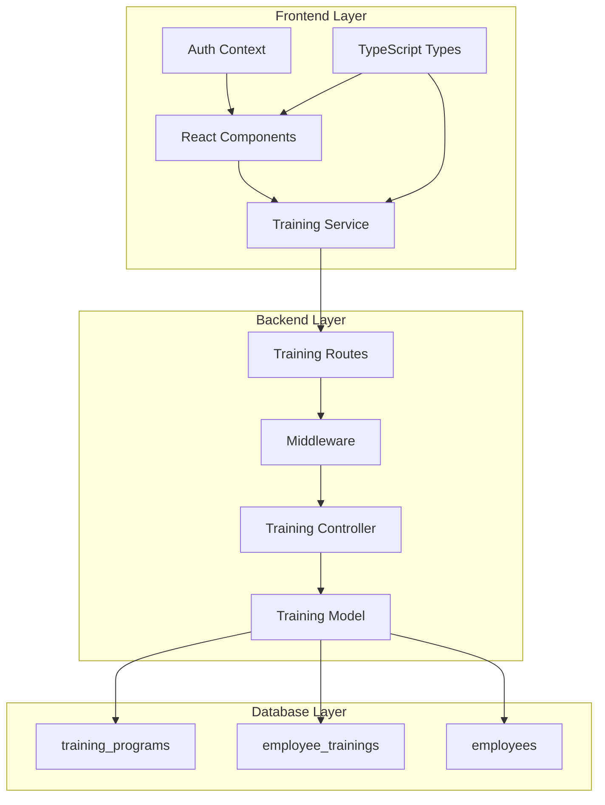
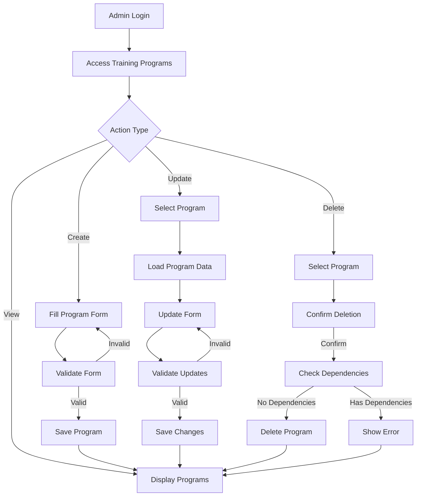
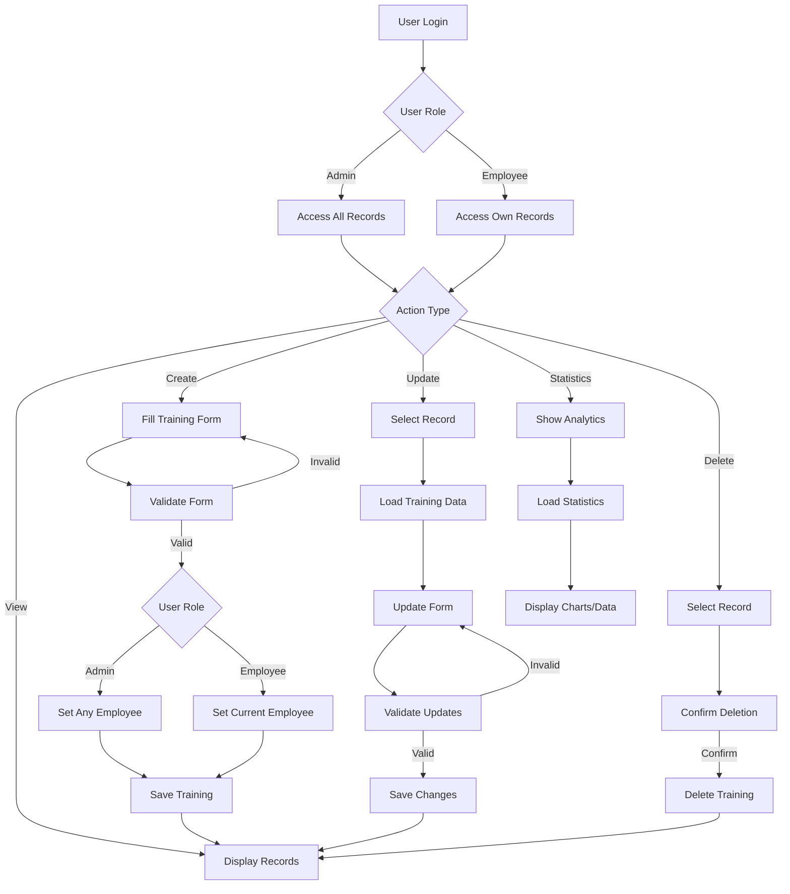
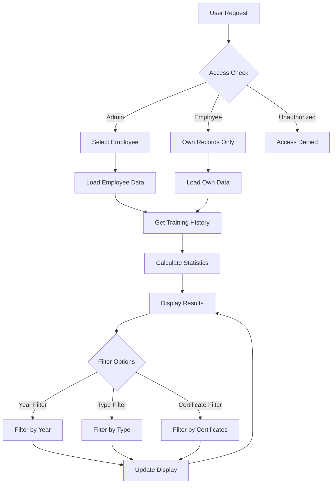

# Training Management System - Workflow and Codebase Documentation

## Overview

The Training Management System is a comprehensive module within the Employee Management System (EMS) that handles employee training programs, training records, and training analytics. It provides role-based access control, advanced filtering, and comprehensive reporting capabilities.

## Table of Contents

1. [System Architecture](#system-architecture)
2. [Backend Components](#backend-components)
3. [Frontend Components](#frontend-components)
4. [Database Schema](#database-schema)
5. [API Endpoints](#api-endpoints)
6. [Workflow Diagrams](#workflow-diagrams)
7. [Access Control](#access-control)
8. [Testing Framework](#testing-framework)
9. [Deployment Guide](#deployment-guide)

## System Architecture



### Technology Stack

- **Backend**: Node.js, Express.js, MySQL
- **Frontend**: React, TypeScript, Vite
- **Authentication**: Session-based with role management
- **Validation**: Express-validator
- **Testing**: Custom live testing scripts
- **Database**: MySQL with foreign key constraints

## Backend Components

### 1. Training Model (`backend/models/Training.js`)

**Purpose**: Handles all database operations for training programs and training records.

**Key Classes:**
- `Training`: Manages employee training records
- `TrainingProgram`: Manages training program templates

**Core Methods:**

```javascript
// Training class methods
Training.findAll(filters)           // Get training records with filtering
Training.findById(id)               // Get specific training record
Training.create()                   // Create new training record
Training.update()                   // Update existing training record
Training.delete(id)                 // Delete training record
Training.getStatistics(filters)     // Get training analytics
Training.getEmployeeTrainings(id)   // Get employee training history

// TrainingProgram class methods
TrainingProgram.findAll()           // Get all training programs
TrainingProgram.findById(id)        // Get specific training program
TrainingProgram.create()            // Create new training program
TrainingProgram.update()            // Update training program
TrainingProgram.delete(id)          // Delete training program
```

**Key Features:**
- MySQL-compatible pagination syntax
- Advanced filtering and search capabilities
- Data validation with comprehensive error handling
- Role-based data access control
- Foreign key constraint management

### 2. Training Controller (`backend/controllers/trainingController.js`)

**Purpose**: Handles HTTP requests and implements business logic.

**Key Functions:**

```javascript
// Training Record Controllers
getAllTrainings()           // GET /api/trainings
getTrainingById()          // GET /api/trainings/:id
createTraining()           // POST /api/trainings
updateTraining()           // PUT /api/trainings/:id
deleteTraining()           // DELETE /api/trainings/:id
getEmployeeTrainings()     // GET /api/trainings/employee/:employeeId
getTrainingStatistics()    // GET /api/trainings/statistics

// Training Program Controllers
getAllTrainingPrograms()    // GET /api/training-programs
getTrainingProgramById()   // GET /api/training-programs/:id
createTrainingProgram()    // POST /api/training-programs
updateTrainingProgram()    // PUT /api/training-programs/:id
deleteTrainingProgram()    // DELETE /api/training-programs/:id
```

**Validation Rules:**
- Training programs: title, training_type validation
- Training records: employee_id, dates, duration validation
- Role-based access control enforcement

### 3. Training Routes (`backend/routes/trainingRoutes.js`)

**Route Organization:**

```javascript
// Authentication required for all routes
router.use(authMiddleware.requireAuth);

// Training Programs (Admin only for CUD operations)
GET    /training-programs
GET    /training-programs/:id
POST   /training-programs    // Admin only
PUT    /training-programs/:id // Admin only
DELETE /training-programs/:id // Admin only

// Training Records
GET    /trainings/statistics
GET    /trainings
POST   /trainings
GET    /trainings/:id
PUT    /trainings/:id
DELETE /trainings/:id
GET    /trainings/employee/:employeeId
```

## Frontend Components

### 1. Service Layer

**Training Service** (Expected structure based on existing services):

```typescript
// frontend/src/services/trainingService.ts
class TrainingService {
  // Training Programs
  async getTrainingPrograms(): Promise<TrainingProgram[]>
  async getTrainingProgram(id: number): Promise<TrainingProgram>
  async createTrainingProgram(data: CreateTrainingProgramDTO): Promise<TrainingProgram>
  async updateTrainingProgram(id: number, data: UpdateTrainingProgramDTO): Promise<TrainingProgram>
  async deleteTrainingProgram(id: number): Promise<void>
  
  // Training Records
  async getTrainings(filters?: TrainingFilters): Promise<TrainingResponse>
  async getTraining(id: number): Promise<Training>
  async createTraining(data: CreateTrainingDTO): Promise<Training>
  async updateTraining(id: number, data: UpdateTrainingDTO): Promise<Training>
  async deleteTraining(id: number): Promise<void>
  
  // Analytics
  async getTrainingStatistics(filters?: StatisticsFilters): Promise<TrainingStatistics>
  async getEmployeeTrainingHistory(employeeId: number): Promise<EmployeeTrainingHistory>
}
```

### 2. TypeScript Types

**Training Types** (Expected structure):

```typescript
// frontend/src/types/training.ts
export interface TrainingProgram {
  id: number;
  title: string;
  description?: string;
  duration_hours?: number;
  training_type: 'Internal' | 'External' | 'Online' | 'Seminar' | 'Workshop';
  created_at: string;
}

export interface Training {
  id: number;
  employee_id: number;
  training_program_id?: number;
  training_title: string;
  start_date: string;
  end_date: string;
  duration_hours?: number;
  venue?: string;
  organizer?: string;
  certificate_issued: boolean;
  certificate_number?: string;
  created_at: string;
  
  // Joined fields
  employee_name?: string;
  employee_number?: string;
  program_title?: string;
  training_type?: string;
}

export interface TrainingFilters {
  employee_id?: number;
  training_program_id?: number;
  training_type?: string;
  start_date?: string;
  end_date?: string;
  year?: number;
  search?: string;
  certificate_issued?: boolean;
  page?: number;
  limit?: number;
  sort_by?: string;
  sort_order?: 'asc' | 'desc';
}
```

### 3. Component Structure

**Expected Frontend Component Architecture:**

```
frontend/src/components/training/
├── AdminTrainingManagement.tsx      # Main admin interface
├── AdminTrainingPrograms.tsx        # Training program management
├── AdminTrainingRecords.tsx         # All training records view
├── EmployeeTrainingManagement.tsx   # Main employee interface
├── EmployeeTrainingHistory.tsx      # Employee training history
├── TrainingProgramCard.tsx          # Training program display
├── TrainingRecordCard.tsx           # Training record display
├── TrainingRecordForm.tsx           # New/edit training form
├── TrainingProgramForm.tsx          # New/edit program form
├── TrainingStatistics.tsx           # Analytics dashboard
└── TrainingFilters.tsx              # Advanced filtering component
```

## Database Schema

### Training Programs Table

```sql
CREATE TABLE training_programs (
    id INT PRIMARY KEY AUTO_INCREMENT,
    title VARCHAR(255) NOT NULL,
    description TEXT,
    duration_hours INT,
    training_type ENUM('Internal', 'External', 'Online', 'Seminar', 'Workshop') NOT NULL,
    created_at TIMESTAMP DEFAULT CURRENT_TIMESTAMP,
    
    INDEX idx_training_type (training_type),
    INDEX idx_title (title)
);
```

### Employee Trainings Table

```sql
CREATE TABLE employee_trainings (
    id INT PRIMARY KEY AUTO_INCREMENT,
    employee_id INT NOT NULL,
    training_program_id INT,
    training_title VARCHAR(255) NOT NULL,
    start_date DATE NOT NULL,
    end_date DATE NOT NULL,
    duration_hours DECIMAL(5,2),
    venue VARCHAR(255),
    organizer VARCHAR(255),
    certificate_issued BOOLEAN DEFAULT FALSE,
    certificate_number VARCHAR(100),
    created_at TIMESTAMP DEFAULT CURRENT_TIMESTAMP,
    
    FOREIGN KEY (employee_id) REFERENCES employees(id) ON DELETE CASCADE,
    FOREIGN KEY (training_program_id) REFERENCES training_programs(id) ON DELETE SET NULL,
    
    INDEX idx_employee_id (employee_id),
    INDEX idx_training_program_id (training_program_id),
    INDEX idx_start_date (start_date),
    INDEX idx_certificate_issued (certificate_issued),
    INDEX idx_training_title (training_title)
);
```

## API Endpoints

### Training Programs

| Method | Endpoint | Access | Description |
|--------|----------|--------|-------------|
| GET | `/api/training-programs` | All | Get all training programs |
| GET | `/api/training-programs/:id` | All | Get specific training program |
| POST | `/api/training-programs` | Admin | Create new training program |
| PUT | `/api/training-programs/:id` | Admin | Update training program |
| DELETE | `/api/training-programs/:id` | Admin | Delete training program |

### Training Records

| Method | Endpoint | Access | Description |
|--------|----------|--------|-------------|
| GET | `/api/trainings` | All | Get training records (filtered by role) |
| GET | `/api/trainings/:id` | Owner/Admin | Get specific training record |
| POST | `/api/trainings` | All | Create training record |
| PUT | `/api/trainings/:id` | Owner/Admin | Update training record |
| DELETE | `/api/trainings/:id` | Owner/Admin | Delete training record |
| GET | `/api/trainings/employee/:id` | Owner/Admin | Get employee training history |
| GET | `/api/trainings/statistics` | All | Get training statistics |

### Query Parameters

**Filtering Parameters:**
- `employee_id`: Filter by employee
- `training_program_id`: Filter by training program
- `training_type`: Filter by type
- `start_date`, `end_date`: Date range filtering
- `year`: Filter by year
- `search`: Search in titles and names
- `certificate_issued`: Filter by certification status

**Pagination Parameters:**
- `page`: Page number (default: 1)
- `limit`: Records per page (default: 10)

**Sorting Parameters:**
- `sort_by`: Field to sort by
- `sort_order`: 'asc' or 'desc'

## Workflow Diagrams

### Training Program Management Workflow



### Training Record Workflow



### Employee Training History Workflow



## Access Control

### Role-Based Permissions

**Administrator Access:**
- Full CRUD operations on training programs
- Full CRUD operations on all training records
- Access to all employee training data
- System-wide training statistics
- User management for training system

**Employee Access:**
- Read-only access to training programs
- CRUD operations on own training records only
- Access to own training history and statistics
- Cannot view other employees' training data

### Security Implementation

```javascript
// Middleware-based access control
router.post('/training-programs', 
    authMiddleware.requireAuth,
    authMiddleware.requireAdmin,
    ...validationRules,
    controller.createTrainingProgram
);

// Controller-level access control
const getAllTrainings = async (req, res) => {
    const currentUser = req.session.user;
    const filters = {};
    
    // Role-based filtering
    if (currentUser.role !== 'admin') {
        filters.employee_id = currentUser.employee_id;
    }
    
    // Apply additional filters...
};
```

## Testing Framework

### Test Scripts Structure

**Comprehensive Testing (`test-training-live.js`):**
1. Authentication testing (admin and employee)
2. Training program management (CRUD operations)
3. Training record management (CRUD operations)
4. Advanced filtering and pagination
5. Statistics and reporting
6. Role-based access control verification
7. Validation and error handling
8. Data cleanup

**Quick Testing (`quick-training-test.js`):**
1. Core workflow verification
2. Basic CRUD operations
3. Essential access control checks
4. Simplified data validation

**Validation Testing (`validate-training-system.js`):**
1. System readiness checks
2. Database connectivity
3. Authentication system verification
4. Basic API endpoint availability

### Test Execution

```bash
# Full system validation
npm run validate:training

# Quick workflow test
npm run test:training-quick

# Comprehensive testing
npm run test:training-live
```

### Test Coverage

- **API Endpoints**: 100% coverage of all training endpoints
- **Authentication**: Admin and employee role verification
- **Data Validation**: All input validation rules tested
- **Error Handling**: 400, 401, 403, 404, 500 error scenarios
- **Business Logic**: Training program dependencies, employee access control
- **Database Operations**: CRUD operations, filtering, pagination

## Deployment Guide

### Prerequisites

1. **Database Setup**
   ```sql
   -- Create training tables
   SOURCE backend/scripts/employee_management_system.sql;
   ```

2. **Environment Configuration**
   ```bash
   # .env file
   DB_HOST=localhost
   DB_PORT=3306
   DB_USER=root
   DB_PASSWORD=your_password
   DB_NAME=employee_management_system
   ```

3. **Dependencies Installation**
   ```bash
   cd backend
   npm install
   
   cd frontend
   npm install
   ```

### Development Deployment

```bash
# Start backend server
cd backend
npm run dev

# Start frontend development server
cd frontend
npm run dev
```

### Production Deployment

```bash
# Build frontend
cd frontend
npm run build

# Start production server
cd backend
npm start
```

### Health Checks

```bash
# System validation
npm run validate:training

# API health check
curl http://localhost:3000/api/health

# Database connectivity
npm run check:database
```

## Performance Considerations

### Database Optimization

- **Indexes**: Strategic indexing on frequently queried fields
- **Query Optimization**: Efficient JOIN operations and pagination
- **Connection Pooling**: MySQL connection pool management

### Frontend Optimization

- **Lazy Loading**: Component-based code splitting
- **Caching**: API response caching with React Query
- **State Management**: Efficient state updates and re-renders

### API Optimization

- **Pagination**: Limit large dataset queries
- **Filtering**: Database-level filtering to reduce data transfer
- **Compression**: Response compression for large datasets

## Security Considerations

### Data Protection

- **Input Validation**: Comprehensive server-side validation
- **SQL Injection Prevention**: Parameterized queries
- **XSS Protection**: Input sanitization and output encoding

### Access Control

- **Session Management**: Secure session handling
- **Role Verification**: Multi-level access control checks
- **Data Isolation**: Employee data segregation

### Audit Trail

- **Activity Logging**: Training record modifications
- **Access Logging**: User access patterns
- **Error Tracking**: Security-related error monitoring

## Future Enhancements

### Planned Features

1. **Advanced Analytics**
   - Training effectiveness metrics
   - Skill gap analysis
   - ROI calculations

2. **Integration Capabilities**
   - External training provider APIs
   - Calendar system integration
   - Notification systems

3. **Enhanced UI/UX**
   - Training calendar view
   - Progress tracking dashboards
   - Mobile responsive design

4. **Reporting System**
   - Automated report generation
   - Export capabilities (PDF, Excel)
   - Scheduled reports

### Scalability Considerations

- **Microservices Architecture**: Training service separation
- **Database Sharding**: Large dataset management
- **Caching Layer**: Redis integration for performance
- **Load Balancing**: Multi-instance deployment support

## Conclusion

The Training Management System provides a comprehensive solution for managing employee training programs and records. With its robust backend architecture, role-based access control, and extensive testing framework, it ensures reliable and secure training data management. The system's modular design and comprehensive API make it suitable for integration with other HR systems and future enhancements.